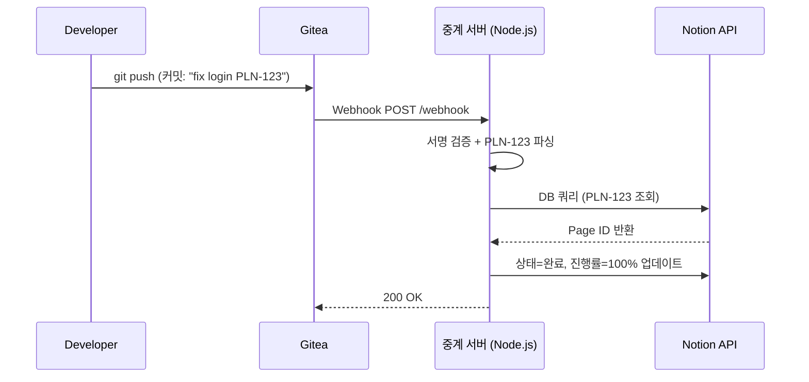

# Gitea - Notion 연동 중계 서버

## 개요

Gitea 커밋/PR 메시지에서 Notion DB 항목 ID(예: `PLN-123`)를 참조하면, 해당 Notion 항목의 **상태를 "완료"**, **진행률을 100%** 로 자동 업데이트하는 중계 서버.

- **스택**: Node.js (Express) + Docker
- **작업 디렉토리**: `C:\dev\workspace\palnet\redmine\`



---

## 사전 준비

### 1. Notion Integration 생성

1. https://www.notion.so/profile/integrations 접속
2. **New integration** 클릭
3. 이름: `Gitea Webhook Bot`, 워크스페이스 선택
4. Capabilities: **Read / Update / Insert content** 체크
5. Submit 후 **Internal Integration Secret** 복사 → `.env`의 `NOTION_API_KEY`

### 2. Notion Database 설정

| 속성 이름              | 타입               | 설명                                    |
| ------------------ | ---------------- | ------------------------------------- |
| **ID** (Unique ID) | Unique ID        | 접두사 `PLN` 설정, 자동 부여 (PLN-1, PLN-2...) |
| **상태**             | Select           | 옵션에 "완료" 포함                           |
| **진행률**            | Number (Percent) | 0~100                                 |

- DB 페이지 → **Connections** → `Gitea Webhook Bot` 연결
- DB URL에서 `database_id` 확인 → `.env`의 `NOTION_DATABASE_ID`

### 3. Gitea Webhook 설정

| 항목 | 값 |
|------|-----|
| URL | `http://<서버IP>:3800/webhook` |
| Content Type | `application/json` |
| Secret | `.env`의 `GITEA_WEBHOOK_SECRET`과 동일 |
| Trigger | Push Events + Pull Request Events |

---

## 프로젝트 구조

```
redmine/
├── docker-compose.yml
├── Dockerfile
├── .env.example
├── .env                    (gitignored)
├── .gitignore
├── .dockerignore
├── package.json
└── src/
    ├── index.js            # Express 서버 진입점 + GET /health
    ├── config.js           # 환경변수 로드 및 검증
    ├── routes/
    │   └── webhook.js      # POST /webhook - Gitea webhook 핸들러
    ├── services/
    │   ├── parser.js       # 커밋 메시지에서 PLN-123 추출
    │   └── notion.js       # Notion API (조회 + 업데이트)
    └── utils/
        ├── logger.js       # pino 구조화 로깅
        └── verify.js       # HMAC-SHA256 서명 검증
```

---

## 핵심 모듈 설명

### config.js
필수 환경변수를 로드하고, 누락 시 서버 시작을 중단한다.

### verify.js
Gitea가 보내는 `X-Gitea-Signature` 헤더를 `HMAC-SHA256(secret, body)`로 비교 검증한다. `crypto.timingSafeEqual` 사용.

### parser.js
`extractReferences(text)` — 텍스트에서 `PLN-\d+` 패턴을 모두 추출, 숫자 배열로 반환 (중복 제거).

```
"fix PLN-10 and PLN-10 also PLN-20" → [10, 20]
```

### notion.js
- `findPageByTaskId(taskId)` — Notion DB에서 unique_id 필터로 조회
- `markComplete(pageId)` — 상태="완료", 진행률=100으로 업데이트

### webhook.js
1. 서명 검증 (실패 시 401)
2. `X-Gitea-Event` 헤더로 이벤트 타입 판별
   - **push**: 각 `commit.message`에서 참조 추출
   - **pull_request**: `title` + `body`에서 참조 추출 (opened/closed/merged)
3. 참조별로 Notion 조회 → 업데이트 (개별 실패 시 로그 후 계속)
4. 200 + 처리 결과 JSON 반환

---

## 환경변수

```env
# Notion
NOTION_API_KEY=secret_xxx
NOTION_DATABASE_ID=xxxxxxxx-xxxx-xxxx-xxxx-xxxxxxxxxxxx
NOTION_PROP_STATUS=상태
NOTION_PROP_PROGRESS=진행률
NOTION_STATUS_DONE=완료

# 참조 패턴 접두사
REF_PATTERN=PLN

# Gitea
GITEA_WEBHOOK_SECRET=your-secret

# Server
PORT=3000
LOG_LEVEL=info
```

---

## 설계 결정

| 항목 | 결정 | 이유 |
|------|------|------|
| 참조 패턴 | `PLN-123` (접두사 설정 가능) | Notion Unique ID와 1:1 매칭 |
| 속성 타입 감지 | 서버 시작 시 DB 스키마 자동 조회 | 설정 오류 방지 |
| 상태 관리 | Stateless | 멱등 연산, 별도 DB 불필요 |
| 에러 처리 | 참조 단위 개별 try/catch | 하나 실패해도 나머지 계속 |
| 외부 포트 | 3800 | Gitea 기본 3000과 충돌 방지 |

---

## 검증 방법

1. `docker compose up --build` 로 서버 기동
2. `GET http://localhost:3800/health` → 200 응답 확인
3. Gitea에서 "Test Delivery" → 서버 로그 수신 확인
4. Notion DB에 테스트 항목 생성 (PLN-1, 상태: 진행중, 진행률: 50%)
5. `git commit -m "fix: resolve login bug PLN-1"` → push
6. Notion에서 상태="완료", 진행률=100% 변경 확인

---

## 향후 확장 (현재 범위 밖)

- **Flow 2**: Notion DB 변경 → Slack 알림 (폴링 방식)
- 처리 이력 SQLite 저장
- 웹 대시보드
- Notion 댓글/담당자 연동
