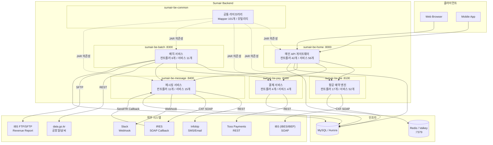
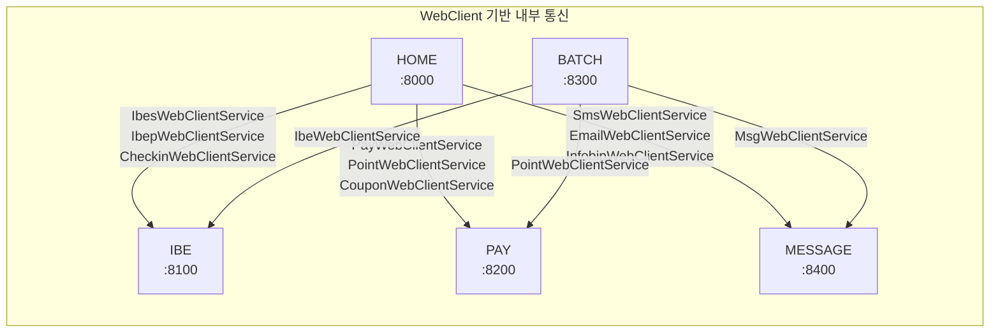
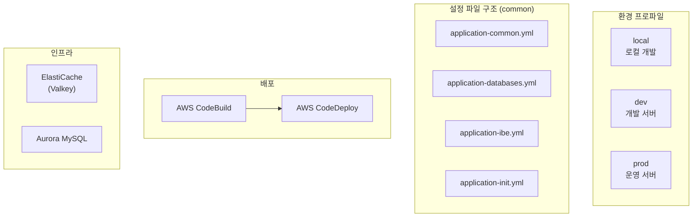

# 시스템 구성도

## 전체 아키텍처

## 모듈 간 통신 관계

## 모듈별 포트 및 역할

| 모듈                    | 포트   | 역할                        |
| --------------------- | ---- | ------------------------- |
| **sumair-be-common**  | -    | 공통 라이브러리 (JAR)            |
| **sumair-be-home**    | 8000 | 메인 API 게이트웨이, 인증, 캐시      |
| **sumair-be-ibe**     | 8100 | 항공 예약 엔진 (IBES/IBEP SOAP) |
| **sumair-be-pay**     | 8200 | 결제/포인트/쿠폰 처리              |
| **sumair-be-batch**   | 8300 | 배치 작업 (Quartz 스케줄러)       |
| **sumair-be-message** | 8400 | SMS/이메일 메시징               |

## 환경 구성

## 외부 연동 상세

| 외부 시스템            | 프로토콜       | 연동 모듈   | 용도                                      |
| ----------------- | ---------- | ------- | --------------------------------------- |
| **IBES** (IBS)    | SOAP (CXF) | IBE     | 항공편 조회, 가격 확인, 시간표, 수하물, 부가서비스          |
| **IBEP** (IBS)    | SOAP (CXF) | IBE     | 예약 생성/변경/취소/분리, 체크인, 좌석 배정, 프로필         |
| **Toss Payments** | REST       | PAY     | 결제 승인/취소/조회, BrandPay 액세스토큰             |
| **Infobip**       | REST       | MESSAGE | SMS 발송, 이메일 발송, 템플릿 관리                  |
| **IRES**          | SOAP (CXF) | MESSAGE | SendITR 콜백 수신 → 이티켓 이메일 발송              |
| **data.go.kr**    | REST (XML) | BATCH   | 공휴일 API, 날씨(동네예보) API                   |
| **IBS FTP/SFTP**  | SFTP       | BATCH   | Revenue Report (Excel), Flight Schedule |
| **Slack**         | Webhook    | MESSAGE | 내부 에러 알림                                |
| **OAuth2**        | REST       | HOME    | Naver, Kakao, Google 소셜 로그인             |
