# 시퀀스 다이어그램

> Home(:8000) endpoint를 기점으로 한 전체 플로우. 모든 다이어그램은 Mermaid 문법.

---

## 1. 항공편 조회 (Flight Availability Search)

### 1-1. 항공편 목록 조회
`POST /airline/booking/avail/get-avail-list`

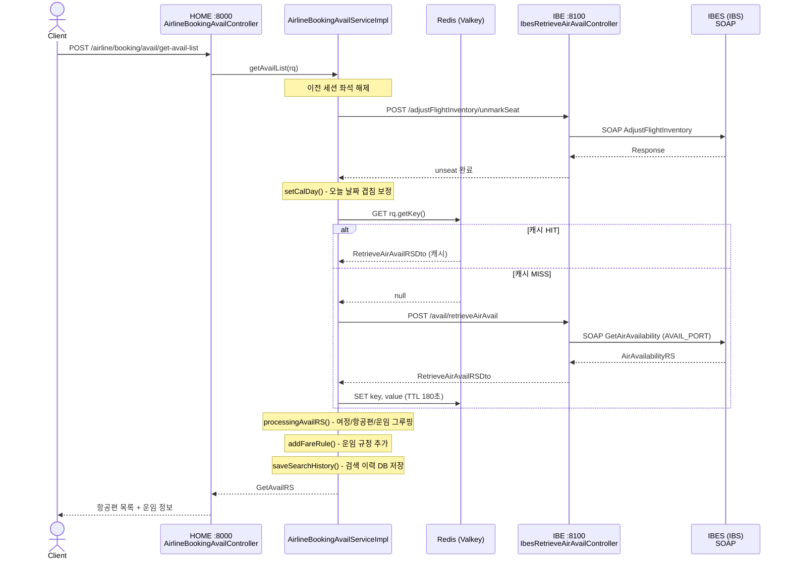
```mermaid
sequenceDiagram
    actor Client
    participant HOME as HOME :8000<br/>AirlineBookingAvailController
    participant SVC as AirlineBookingAvailServiceImpl
    participant REDIS as Redis (Valkey)
    participant IBE as IBE :8100<br/>IbesRetrieveAirAvailController
    participant IBES as IBES (IBS)<br/>SOAP

    Client->>HOME: POST /airline/booking/avail/get-avail-list
    HOME->>SVC: getAvailList(rq)

    Note over SVC: 이전 세션 좌석 해제
    SVC->>IBE: POST /adjustFlightInventory/unmarkSeat
    IBE->>IBES: SOAP AdjustFlightInventory
    IBES-->>IBE: Response
    IBE-->>SVC: unseat 완료

    Note over SVC: setCalDay() - 오늘 날짜 겹침 보정
    SVC->>REDIS: GET rq.getKey()

    alt 캐시 HIT
        REDIS-->>SVC: RetrieveAirAvailRSDto (캐시)
    else 캐시 MISS
        REDIS-->>SVC: null
        SVC->>IBE: POST /avail/retrieveAirAvail
        IBE->>IBES: SOAP GetAirAvailability (AVAIL_PORT)
        IBES-->>IBE: AirAvailabilityRS
        IBE-->>SVC: RetrieveAirAvailRSDto
        SVC->>REDIS: SET key, value (TTL 180초)
    end

    Note over SVC: processingAvailRS() - 여정/항공편/운임 그루핑
    Note over SVC: addFareRule() - 운임 규정 추가
    Note over SVC: saveSearchHistory() - 검색 이력 DB 저장
    SVC-->>HOME: GetAvailRS
    HOME-->>Client: 항공편 목록 + 운임 정보
```

### 1-2. 가격 확정
`POST /airline/booking/avail/confirm-price`

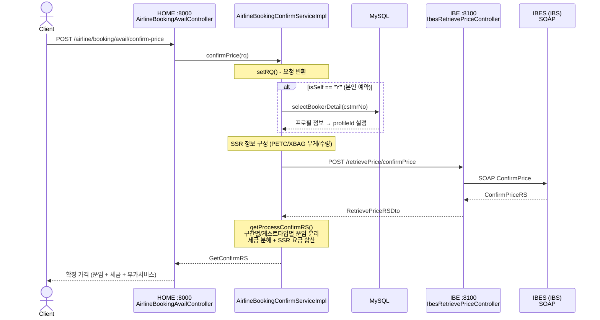
```mermaid
sequenceDiagram
    actor Client
    participant HOME as HOME :8000<br/>AirlineBookingAvailController
    participant SVC as AirlineBookingConfirmServiceImpl
    participant DB as MySQL
    participant IBE as IBE :8100<br/>IbesRetrievePriceController
    participant IBES as IBES (IBS)<br/>SOAP

    Client->>HOME: POST /airline/booking/avail/confirm-price
    HOME->>SVC: confirmPrice(rq)

    Note over SVC: setRQ() - 요청 변환
    alt isSelf == "Y" (본인 예약)
        SVC->>DB: selectBookerDetail(cstmrNo)
        DB-->>SVC: 프로필 정보 → profileId 설정
    end
    Note over SVC: SSR 정보 구성 (PETC/XBAG 무게/수량)

    SVC->>IBE: POST /retrievePrice/confirmPrice
    IBE->>IBES: SOAP ConfirmPrice
    IBES-->>IBE: ConfirmPriceRS
    IBE-->>SVC: RetrievePriceRSDto

    Note over SVC: getProcessConfirmRS()<br/>구간별/게스트타입별 운임 분리<br/>세금 분해 + SSR 요금 합산
    SVC-->>HOME: GetConfirmRS
    HOME-->>Client: 확정 가격 (운임 + 세금 + 부가서비스)
```

### 1-3. Enhanced 항공편 조회 (왕복 귀국편 재조회)
`POST /airline/booking/avail/get-enhanced-avail-list`

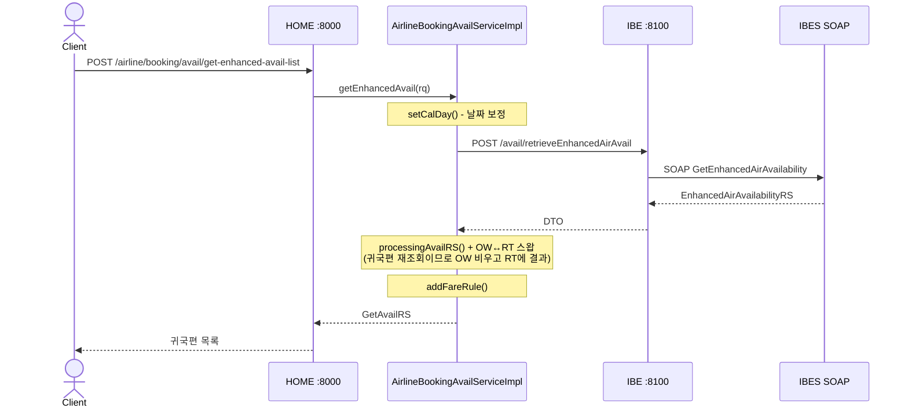
```mermaid
sequenceDiagram
    actor Client
    participant HOME as HOME :8000
    participant SVC as AirlineBookingAvailServiceImpl
    participant IBE as IBE :8100
    participant IBES as IBES SOAP

    Client->>HOME: POST /airline/booking/avail/get-enhanced-avail-list
    HOME->>SVC: getEnhancedAvail(rq)
    Note over SVC: setCalDay() - 날짜 보정
    SVC->>IBE: POST /avail/retrieveEnhancedAirAvail
    IBE->>IBES: SOAP GetEnhancedAirAvailability
    IBES-->>IBE: EnhancedAirAvailabilityRS
    IBE-->>SVC: DTO
    Note over SVC: processingAvailRS() + OW↔RT 스왑<br/>(귀국편 재조회이므로 OW 비우고 RT에 결과)
    Note over SVC: addFareRule()
    SVC-->>HOME: GetAvailRS
    HOME-->>Client: 귀국편 목록
```

---

## 2. 예약 생성 (Create Booking)

`POST /airline/booking/create`

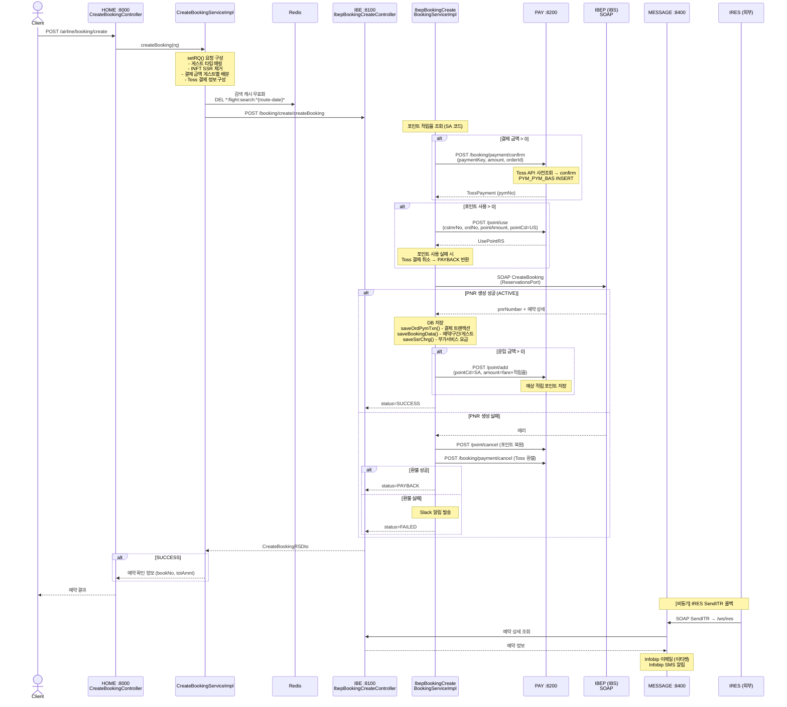
```mermaid
sequenceDiagram
    actor Client
    participant HOME as HOME :8000<br/>CreateBookingController
    participant SVC as CreateBookingServiceImpl
    participant REDIS as Redis
    participant IBE as IBE :8100<br/>IbepBookingCreateController
    participant IBE_SVC as IbepBookingCreate<br/>BookingServiceImpl
    participant PAY as PAY :8200
    participant IBES as IBEP (IBS)<br/>SOAP
    participant MSG as MESSAGE :8400
    participant IRES as IRES (외부)

    Client->>HOME: POST /airline/booking/create
    HOME->>SVC: createBooking(rq)

    Note over SVC: setRQ() 요청 구성<br/>- 게스트 타입 매핑<br/>- INFT SSR 제거<br/>- 결제 금액 게스트별 배분<br/>- Toss 결제 정보 구성

    SVC->>REDIS: 검색 캐시 무효화<br/>DEL *:flight:search:*{route-date}*

    SVC->>IBE: POST /booking/create/createBooking

    Note over IBE_SVC: 포인트 적립율 조회 (SA 코드)

    alt 결제 금액 > 0
        IBE_SVC->>PAY: POST /booking/payment/confirm<br/>(paymentKey, amount, orderId)
        Note over PAY: Toss API 사전조회 → confirm<br/>PYM_PYM_BAS INSERT
        PAY-->>IBE_SVC: TossPayment (pymNo)
    end

    alt 포인트 사용 > 0
        IBE_SVC->>PAY: POST /point/use<br/>(cstmrNo, ordNo, pointAmount, pointCd=US)
        PAY-->>IBE_SVC: UsePointRS
        Note over IBE_SVC: 포인트 사용 실패 시<br/>Toss 결제 취소 → PAYBACK 반환
    end

    IBE_SVC->>IBES: SOAP CreateBooking<br/>(ReservationsPort)

    alt PNR 생성 성공 (ACTIVE)
        IBES-->>IBE_SVC: pnrNumber + 예약 상세
        Note over IBE_SVC: DB 저장<br/>saveOrdPymTxn() - 결제 트랜잭션<br/>saveBookingData() - 예약/구간/게스트<br/>saveSsrChrg() - 부가서비스 요금

        alt 운임 금액 > 0
            IBE_SVC->>PAY: POST /point/add<br/>(pointCd=SA, amount=fare×적립율)
            Note over PAY: 예상 적립 포인트 저장
        end

        IBE_SVC-->>IBE: status=SUCCESS
    else PNR 생성 실패
        IBES-->>IBE_SVC: 에러
        IBE_SVC->>PAY: POST /point/cancel (포인트 복원)
        IBE_SVC->>PAY: POST /booking/payment/cancel (Toss 환불)
        alt 환불 성공
            IBE_SVC-->>IBE: status=PAYBACK
        else 환불 실패
            Note over IBE_SVC: Slack 알림 발송
            IBE_SVC-->>IBE: status=FAILED
        end
    end

    IBE-->>SVC: CreateBookingRSDto

    alt SUCCESS
        SVC-->>HOME: 예약 확인 정보 (bookNo, totAmnt)
    end
    HOME-->>Client: 예약 결과

    Note over IRES, MSG: [비동기] IRES SendITR 콜백
    IRES->>MSG: SOAP SendITR → /ws/ires
    MSG->>IBE: 예약 상세 조회
    IBE-->>MSG: 예약 정보
    Note over MSG: Infobip 이메일 (이티켓)<br/>Infobip SMS 알림
```

### 예약 생성 상태 코드

| 상태 | 의미 |
|------|------|
| **SUCCESS** | PNR 생성 + 결제 확인 + DB 저장 완료 |
| **PAYBACK** | PNR 실패, Toss 환불 성공 |
| **FAILED** | PNR 실패 + Toss 환불도 실패 (Slack 알림) |
| **IS APPROVED** | 중복 결제 (이미 승인된 건) |

---

## 3. 예약 취소 (Cancel Booking)

### 3-1. 취소 조회 (환불금액 확인)
`POST /airline/booking/modify-cancel`

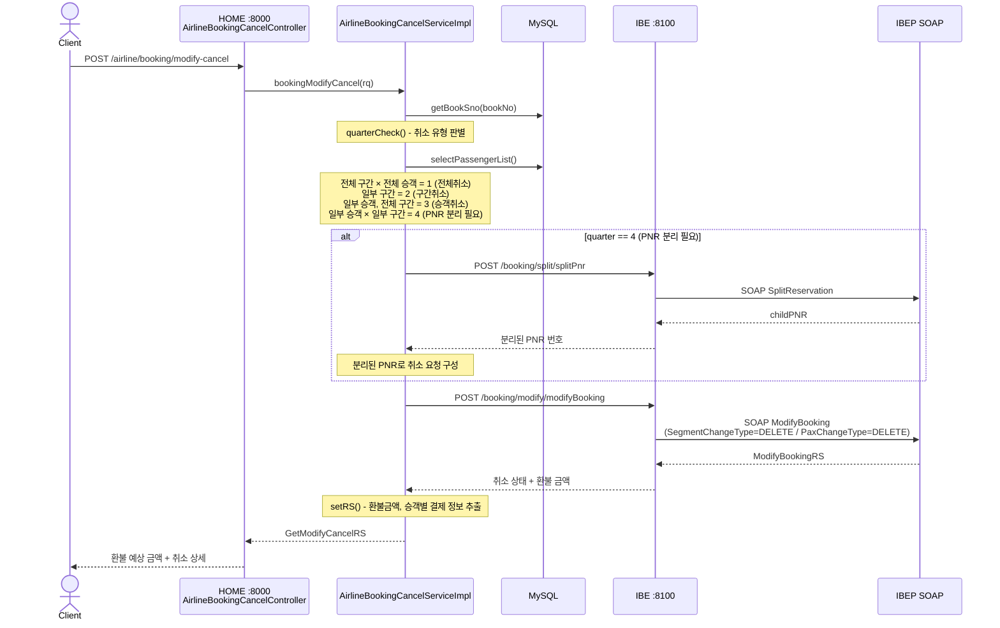
```mermaid
sequenceDiagram
    actor Client
    participant HOME as HOME :8000<br/>AirlineBookingCancelController
    participant SVC as AirlineBookingCancelServiceImpl
    participant DB as MySQL
    participant IBE as IBE :8100
    participant IBEP as IBEP SOAP

    Client->>HOME: POST /airline/booking/modify-cancel
    HOME->>SVC: bookingModifyCancel(rq)

    SVC->>DB: getBookSno(bookNo)

    Note over SVC: quarterCheck() - 취소 유형 판별
    SVC->>DB: selectPassengerList()

    Note over SVC: 전체 구간 × 전체 승객 = 1 (전체취소)<br/>일부 구간 = 2 (구간취소)<br/>일부 승객, 전체 구간 = 3 (승객취소)<br/>일부 승객 × 일부 구간 = 4 (PNR 분리 필요)

    alt quarter == 4 (PNR 분리 필요)
        SVC->>IBE: POST /booking/split/splitPnr
        IBE->>IBEP: SOAP SplitReservation
        IBEP-->>IBE: childPNR
        IBE-->>SVC: 분리된 PNR 번호
        Note over SVC: 분리된 PNR로 취소 요청 구성
    end

    SVC->>IBE: POST /booking/modify/modifyBooking
    IBE->>IBEP: SOAP ModifyBooking<br/>(SegmentChangeType=DELETE / PaxChangeType=DELETE)
    IBEP-->>IBE: ModifyBookingRS
    IBE-->>SVC: 취소 상태 + 환불 금액

    Note over SVC: setRS() - 환불금액, 승객별 결제 정보 추출
    SVC-->>HOME: GetModifyCancelRS
    HOME-->>Client: 환불 예상 금액 + 취소 상세
```

### 3-2. 취소 확정
`POST /airline/booking/save-cancel`

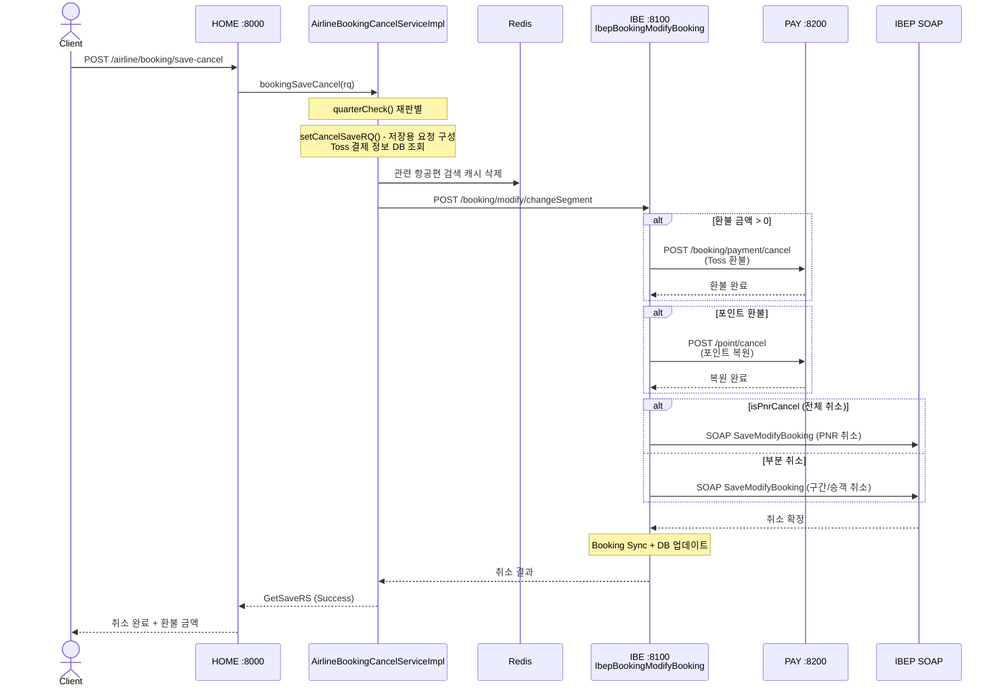
```mermaid
sequenceDiagram
    actor Client
    participant HOME as HOME :8000
    participant SVC as AirlineBookingCancelServiceImpl
    participant REDIS as Redis
    participant IBE as IBE :8100<br/>IbepBookingModifyBooking
    participant PAY as PAY :8200
    participant IBEP as IBEP SOAP

    Client->>HOME: POST /airline/booking/save-cancel
    HOME->>SVC: bookingSaveCancel(rq)

    Note over SVC: quarterCheck() 재판별
    Note over SVC: setCancelSaveRQ() - 저장용 요청 구성<br/>Toss 결제 정보 DB 조회

    SVC->>REDIS: 관련 항공편 검색 캐시 삭제

    SVC->>IBE: POST /booking/modify/changeSegment

    alt 환불 금액 > 0
        IBE->>PAY: POST /booking/payment/cancel<br/>(Toss 환불)
        PAY-->>IBE: 환불 완료
    end

    alt 포인트 환불
        IBE->>PAY: POST /point/cancel<br/>(포인트 복원)
        PAY-->>IBE: 복원 완료
    end

    alt isPnrCancel (전체 취소)
        IBE->>IBEP: SOAP SaveModifyBooking (PNR 취소)
    else 부분 취소
        IBE->>IBEP: SOAP SaveModifyBooking (구간/승객 취소)
    end
    IBEP-->>IBE: 취소 확정

    Note over IBE: Booking Sync + DB 업데이트
    IBE-->>SVC: 취소 결과
    SVC-->>HOME: GetSaveRS (Success)
    HOME-->>Client: 취소 완료 + 환불 금액
```

---

## 4. 예약 변경 — 부가서비스 (SSR)

### 4-1. SSR 추가 금액 조회
`POST /airline/booking/modify-ssr-update`

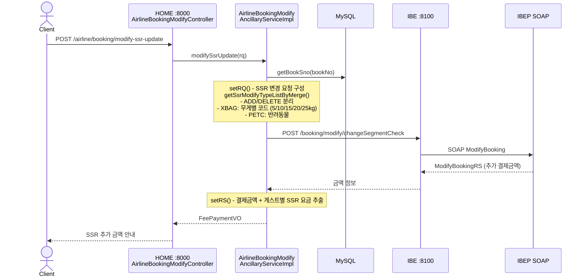
```mermaid
sequenceDiagram
    actor Client
    participant HOME as HOME :8000<br/>AirlineBookingModifyController
    participant SVC as AirlineBookingModify<br/>AncillaryServiceImpl
    participant DB as MySQL
    participant IBE as IBE :8100
    participant IBEP as IBEP SOAP

    Client->>HOME: POST /airline/booking/modify-ssr-update
    HOME->>SVC: modifySsrUpdate(rq)

    SVC->>DB: getBookSno(bookNo)
    Note over SVC: setRQ() - SSR 변경 요청 구성<br/>getSsrModifyTypeListByMerge()<br/>- ADD/DELETE 분리<br/>- XBAG: 무게별 코드 (5/10/15/20/25kg)<br/>- PETC: 반려동물

    SVC->>IBE: POST /booking/modify/changeSegmentCheck
    IBE->>IBEP: SOAP ModifyBooking
    IBEP-->>IBE: ModifyBookingRS (추가 결제금액)
    IBE-->>SVC: 금액 정보

    Note over SVC: setRS() - 결제금액 + 게스트별 SSR 요금 추출
    SVC-->>HOME: FeePaymentVO
    HOME-->>Client: SSR 추가 금액 안내
```

### 4-2. SSR 추가 결제 확정
`POST /airline/booking/save-ssr-update`

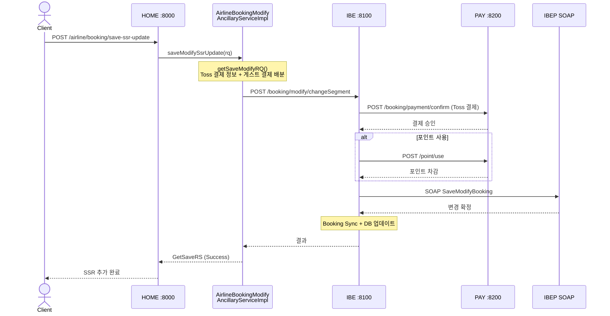
```mermaid
sequenceDiagram
    actor Client
    participant HOME as HOME :8000
    participant SVC as AirlineBookingModify<br/>AncillaryServiceImpl
    participant IBE as IBE :8100
    participant PAY as PAY :8200
    participant IBEP as IBEP SOAP

    Client->>HOME: POST /airline/booking/save-ssr-update
    HOME->>SVC: saveModifySsrUpdate(rq)

    Note over SVC: getSaveModifyRQ()<br/>Toss 결제 정보 + 게스트 결제 배분

    SVC->>IBE: POST /booking/modify/changeSegment

    IBE->>PAY: POST /booking/payment/confirm (Toss 결제)
    PAY-->>IBE: 결제 승인

    alt 포인트 사용
        IBE->>PAY: POST /point/use
        PAY-->>IBE: 포인트 차감
    end

    IBE->>IBEP: SOAP SaveModifyBooking
    IBEP-->>IBE: 변경 확정

    Note over IBE: Booking Sync + DB 업데이트
    IBE-->>SVC: 결과
    SVC-->>HOME: GetSaveRS (Success)
    HOME-->>Client: SSR 추가 완료
```

---

## 5. 예약 변경 — 좌석 (Seat)

### 5-1. 좌석 변경 금액 조회
`POST /airline/booking/modify-seat-update`

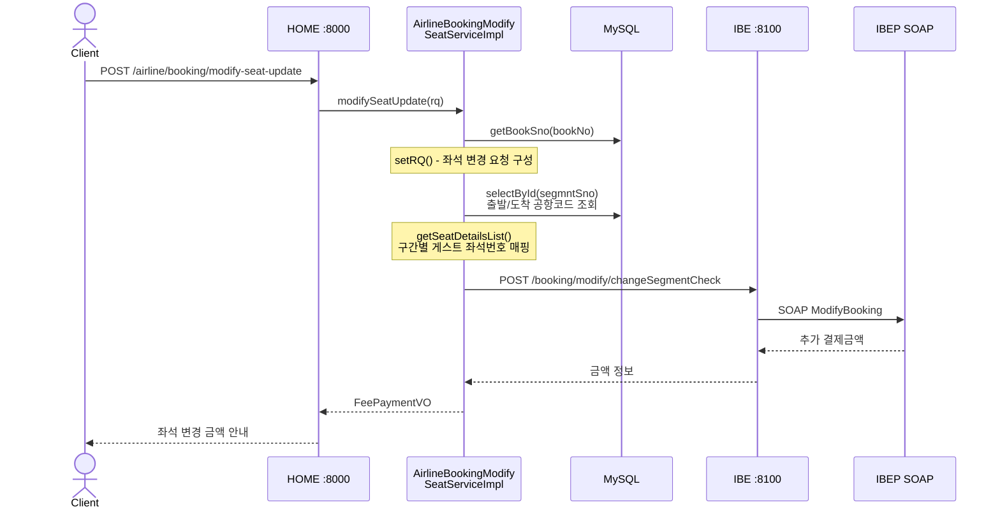
```mermaid
sequenceDiagram
    actor Client
    participant HOME as HOME :8000
    participant SVC as AirlineBookingModify<br/>SeatServiceImpl
    participant DB as MySQL
    participant IBE as IBE :8100
    participant IBEP as IBEP SOAP

    Client->>HOME: POST /airline/booking/modify-seat-update
    HOME->>SVC: modifySeatUpdate(rq)

    SVC->>DB: getBookSno(bookNo)
    Note over SVC: setRQ() - 좌석 변경 요청 구성
    SVC->>DB: selectById(segmntSno)<br/>출발/도착 공항코드 조회
    Note over SVC: getSeatDetailsList()<br/>구간별 게스트 좌석번호 매핑

    SVC->>IBE: POST /booking/modify/changeSegmentCheck
    IBE->>IBEP: SOAP ModifyBooking
    IBEP-->>IBE: 추가 결제금액
    IBE-->>SVC: 금액 정보

    SVC-->>HOME: FeePaymentVO
    HOME-->>Client: 좌석 변경 금액 안내
```

### 5-2. 좌석 변경 결제 확정
`POST /airline/booking/save-seat-update`

> save-ssr-update와 동일한 패턴 (changeSegment → Toss 결제 → IBEP SOAP → DB 동기화)

---

## 6. 웹 체크인 (Web Check-in)

### 6-1. 체크인 가능 승객 조회
`POST /airline/checkin/search-guest`

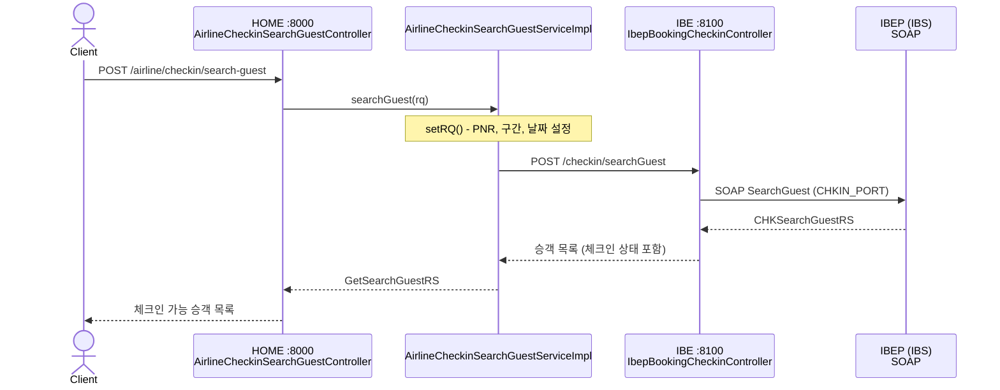
```mermaid
sequenceDiagram
    actor Client
    participant HOME as HOME :8000<br/>AirlineCheckinSearchGuestController
    participant SVC as AirlineCheckinSearchGuestServiceImpl
    participant IBE as IBE :8100<br/>IbepBookingCheckinController
    participant IBEP as IBEP (IBS)<br/>SOAP

    Client->>HOME: POST /airline/checkin/search-guest
    HOME->>SVC: searchGuest(rq)
    Note over SVC: setRQ() - PNR, 구간, 날짜 설정
    SVC->>IBE: POST /checkin/searchGuest
    IBE->>IBEP: SOAP SearchGuest (CHKIN_PORT)
    IBEP-->>IBE: CHKSearchGuestRS
    IBE-->>SVC: 승객 목록 (체크인 상태 포함)
    SVC-->>HOME: GetSearchGuestRS
    HOME-->>Client: 체크인 가능 승객 목록
```

### 6-2. 체크인 실행
`POST /airline/checkin/checkin-guest`

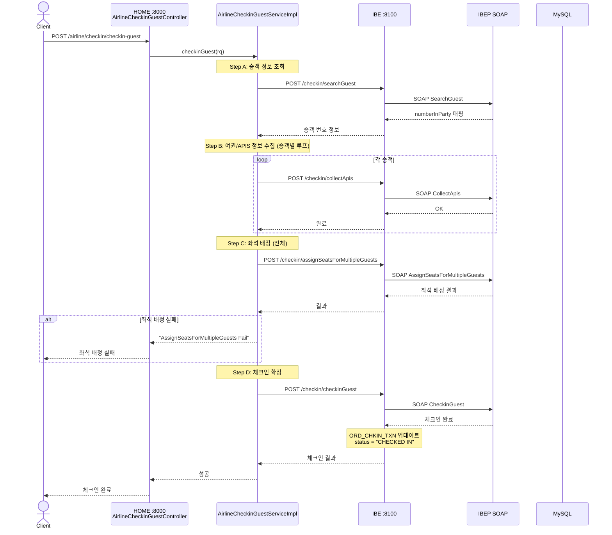
```mermaid
sequenceDiagram
    actor Client
    participant HOME as HOME :8000<br/>AirlineCheckinGuestController
    participant SVC as AirlineCheckinGuestServiceImpl
    participant IBE as IBE :8100
    participant IBEP as IBEP SOAP
    participant DB as MySQL

    Client->>HOME: POST /airline/checkin/checkin-guest
    HOME->>SVC: checkinGuest(rq)

    Note over SVC: Step A: 승객 정보 조회
    SVC->>IBE: POST /checkin/searchGuest
    IBE->>IBEP: SOAP SearchGuest
    IBEP-->>IBE: numberInParty 매핑
    IBE-->>SVC: 승객 번호 정보

    Note over SVC: Step B: 여권/APIS 정보 수집 (승객별 루프)
    loop 각 승객
        SVC->>IBE: POST /checkin/collectApis
        IBE->>IBEP: SOAP CollectApis
        IBEP-->>IBE: OK
        IBE-->>SVC: 완료
    end

    Note over SVC: Step C: 좌석 배정 (전체)
    SVC->>IBE: POST /checkin/assignSeatsForMultipleGuests
    IBE->>IBEP: SOAP AssignSeatsForMultipleGuests
    IBEP-->>IBE: 좌석 배정 결과
    IBE-->>SVC: 결과

    alt 좌석 배정 실패
        SVC-->>HOME: "AssignSeatsForMultipleGuests Fail"
        HOME-->>Client: 좌석 배정 실패
    end

    Note over SVC: Step D: 체크인 확정
    SVC->>IBE: POST /checkin/checkinGuest
    IBE->>IBEP: SOAP CheckinGuest
    IBEP-->>IBE: 체크인 완료
    Note over IBE: ORD_CHKIN_TXN 업데이트<br/>status = "CHECKED IN"
    IBE-->>SVC: 체크인 결과
    SVC-->>HOME: 성공
    HOME-->>Client: 체크인 완료
```

### 6-3. 좌석 배치도 조회
`POST /airline/checkin/seat-map/get-seat-data`

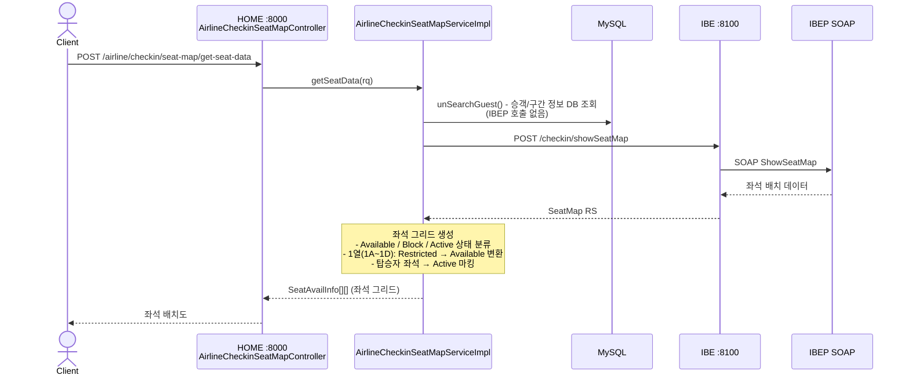
```mermaid
sequenceDiagram
    actor Client
    participant HOME as HOME :8000<br/>AirlineCheckinSeatMapController
    participant SVC as AirlineCheckinSeatMapServiceImpl
    participant DB as MySQL
    participant IBE as IBE :8100
    participant IBEP as IBEP SOAP

    Client->>HOME: POST /airline/checkin/seat-map/get-seat-data
    HOME->>SVC: getSeatData(rq)

    SVC->>DB: unSearchGuest() - 승객/구간 정보 DB 조회<br/>(IBEP 호출 없음)

    SVC->>IBE: POST /checkin/showSeatMap
    IBE->>IBEP: SOAP ShowSeatMap
    IBEP-->>IBE: 좌석 배치 데이터
    IBE-->>SVC: SeatMap RS

    Note over SVC: 좌석 그리드 생성<br/>- Available / Block / Active 상태 분류<br/>- 1열(1A~1D): Restricted → Available 변환<br/>- 탑승자 좌석 → Active 마킹
    SVC-->>HOME: SeatAvailInfo[][] (좌석 그리드)
    HOME-->>Client: 좌석 배치도
```

### 6-4. 보딩패스 출력
`POST /airline/checkin/print-boarding-pass`

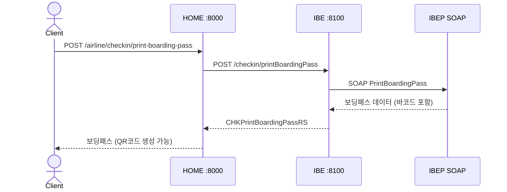
```mermaid
sequenceDiagram
    actor Client
    participant HOME as HOME :8000
    participant IBE as IBE :8100
    participant IBEP as IBEP SOAP

    Client->>HOME: POST /airline/checkin/print-boarding-pass
    HOME->>IBE: POST /checkin/printBoardingPass
    IBE->>IBEP: SOAP PrintBoardingPass
    IBEP-->>IBE: 보딩패스 데이터 (바코드 포함)
    IBE-->>HOME: CHKPrintBoardingPassRS
    HOME-->>Client: 보딩패스 (QR코드 생성 가능)
```

---

## 7. 결제 (Payment)

### 7-1. BrandPay 액세스 토큰
`POST /common/pay/getAccessToken`

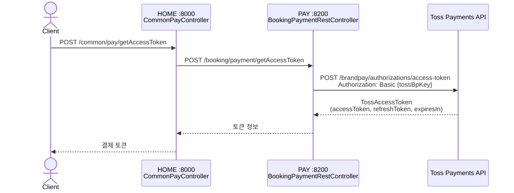
```mermaid
sequenceDiagram
    actor Client
    participant HOME as HOME :8000<br/>CommonPayController
    participant PAY as PAY :8200<br/>BookingPaymentRestController
    participant TOSS as Toss Payments API

    Client->>HOME: POST /common/pay/getAccessToken
    HOME->>PAY: POST /booking/payment/getAccessToken
    PAY->>TOSS: POST /brandpay/authorizations/access-token<br/>Authorization: Basic {tossBpKey}
    TOSS-->>PAY: TossAccessToken<br/>(accessToken, refreshToken, expiresIn)
    PAY-->>HOME: 토큰 정보
    HOME-->>Client: 결제 토큰
```

### 7-2. 결제 승인 (Confirm)
`POST /booking/payment/confirm` (IBE에서 직접 호출)

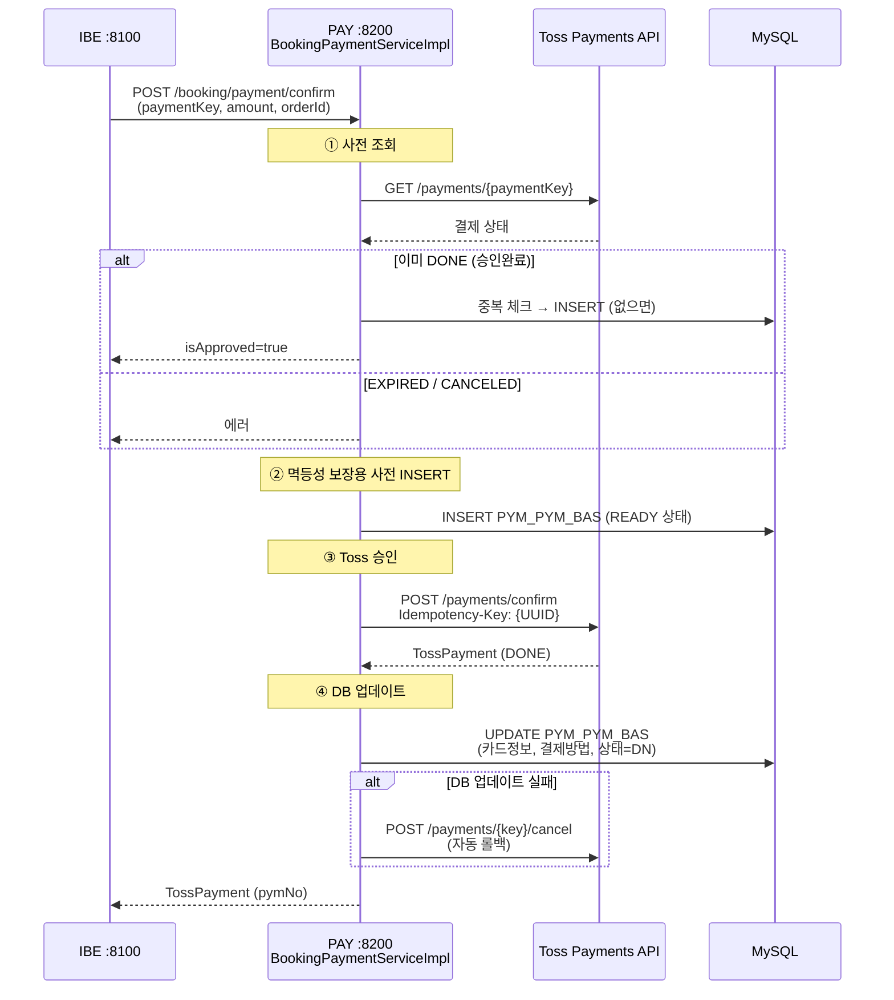
```mermaid
sequenceDiagram
    participant IBE as IBE :8100
    participant PAY as PAY :8200<br/>BookingPaymentServiceImpl
    participant TOSS as Toss Payments API
    participant DB as MySQL

    IBE->>PAY: POST /booking/payment/confirm<br/>(paymentKey, amount, orderId)

    Note over PAY: ① 사전 조회
    PAY->>TOSS: GET /payments/{paymentKey}
    TOSS-->>PAY: 결제 상태

    alt 이미 DONE (승인완료)
        PAY->>DB: 중복 체크 → INSERT (없으면)
        PAY-->>IBE: isApproved=true
    else EXPIRED / CANCELED
        PAY-->>IBE: 에러
    end

    Note over PAY: ② 멱등성 보장용 사전 INSERT
    PAY->>DB: INSERT PYM_PYM_BAS (READY 상태)

    Note over PAY: ③ Toss 승인
    PAY->>TOSS: POST /payments/confirm<br/>Idempotency-Key: {UUID}
    TOSS-->>PAY: TossPayment (DONE)

    Note over PAY: ④ DB 업데이트
    PAY->>DB: UPDATE PYM_PYM_BAS<br/>(카드정보, 결제방법, 상태=DN)

    alt DB 업데이트 실패
        PAY->>TOSS: POST /payments/{key}/cancel<br/>(자동 롤백)
    end

    PAY-->>IBE: TossPayment (pymNo)
```

### 7-3. 결제 취소 (Cancel)
`POST /booking/payment/cancel`

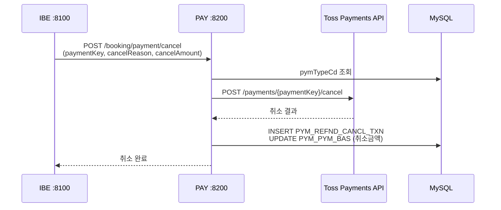
```mermaid
sequenceDiagram
    participant IBE as IBE :8100
    participant PAY as PAY :8200
    participant TOSS as Toss Payments API
    participant DB as MySQL

    IBE->>PAY: POST /booking/payment/cancel<br/>(paymentKey, cancelReason, cancelAmount)
    PAY->>DB: pymTypeCd 조회
    PAY->>TOSS: POST /payments/{paymentKey}/cancel
    TOSS-->>PAY: 취소 결과
    PAY->>DB: INSERT PYM_REFND_CANCL_TXN<br/>UPDATE PYM_PYM_BAS (취소금액)
    PAY-->>IBE: 취소 완료
```

---

## 8. 포인트 (Point)

### 8-1. 포인트 조회
`POST /mypage/point/search`

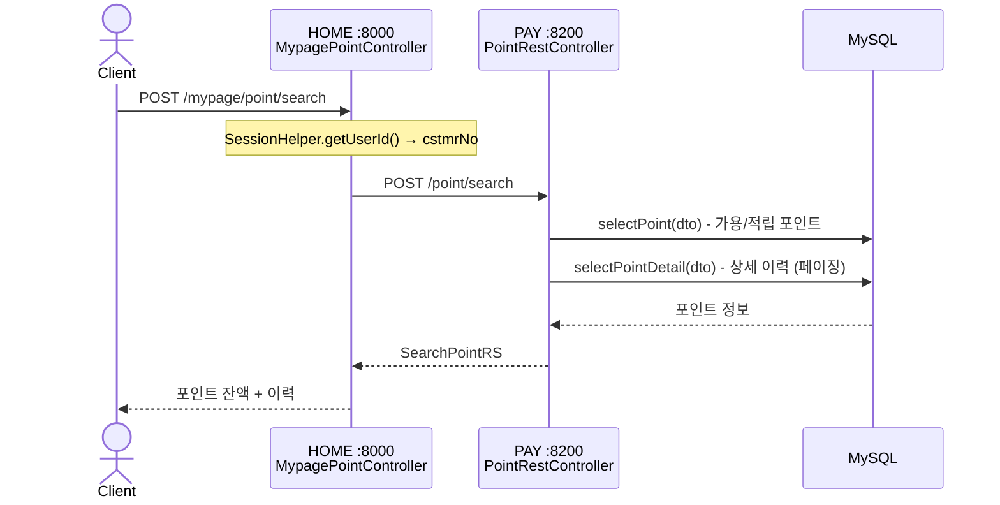
```mermaid
sequenceDiagram
    actor Client
    participant HOME as HOME :8000<br/>MypagePointController
    participant PAY as PAY :8200<br/>PointRestController
    participant DB as MySQL

    Client->>HOME: POST /mypage/point/search
    Note over HOME: SessionHelper.getUserId() → cstmrNo
    HOME->>PAY: POST /point/search
    PAY->>DB: selectPoint(dto) - 가용/적립 포인트
    PAY->>DB: selectPointDetail(dto) - 상세 이력 (페이징)
    DB-->>PAY: 포인트 정보
    PAY-->>HOME: SearchPointRS
    HOME-->>Client: 포인트 잔액 + 이력
```

### 8-2. 포인트 사용 (예약 시)

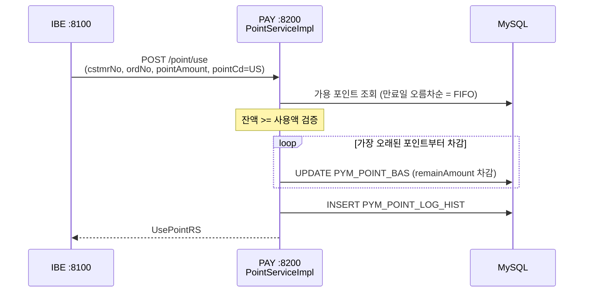
```mermaid
sequenceDiagram
    participant IBE as IBE :8100
    participant PAY as PAY :8200<br/>PointServiceImpl
    participant DB as MySQL

    IBE->>PAY: POST /point/use<br/>(cstmrNo, ordNo, pointAmount, pointCd=US)

    PAY->>DB: 가용 포인트 조회 (만료일 오름차순 = FIFO)
    Note over PAY: 잔액 >= 사용액 검증

    loop 가장 오래된 포인트부터 차감
        PAY->>DB: UPDATE PYM_POINT_BAS (remainAmount 차감)
    end
    PAY->>DB: INSERT PYM_POINT_LOG_HIST
    PAY-->>IBE: UsePointRS
```

### 8-3. 포인트 전체 흐름

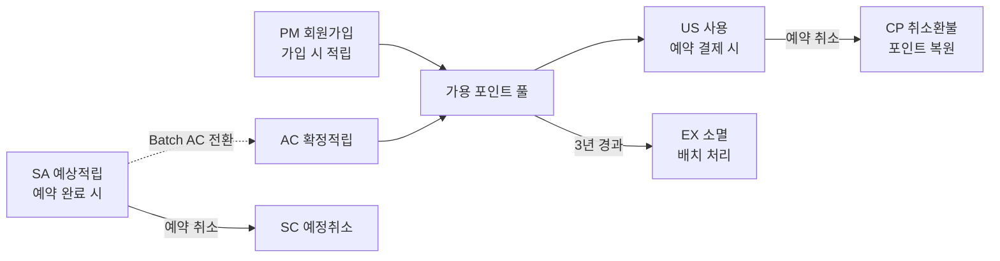
```mermaid
graph LR
    PM["PM 회원가입<br/>가입 시 적립"] --> POOL["가용 포인트 풀"]
    SA["SA 예상적립<br/>예약 완료 시"] -.->|"Batch AC 전환"| AC["AC 확정적립"]
    AC --> POOL
    POOL --> US["US 사용<br/>예약 결제 시"]
    US -->|"예약 취소"| CP["CP 취소환불<br/>포인트 복원"]
    SA -->|"예약 취소"| SC["SC 예정취소"]
    POOL -->|"3년 경과"| EX["EX 소멸<br/>배치 처리"]
```

---

## 9. 회원 / 인증 (Auth)

### 9-1. 이메일 로그인
`POST /customer/login` (JwtLoginFilter)

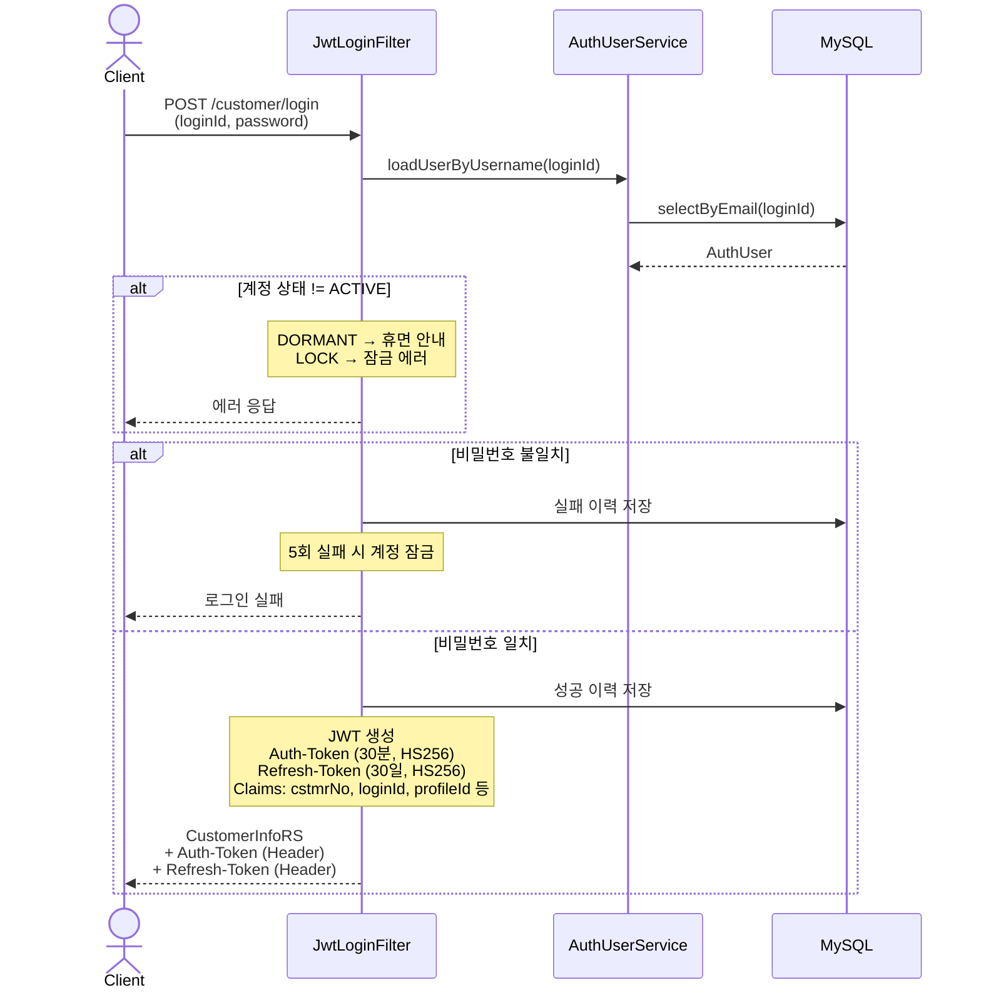
```mermaid
sequenceDiagram
    actor Client
    participant FILTER as JwtLoginFilter
    participant AUTH as AuthUserService
    participant DB as MySQL

    Client->>FILTER: POST /customer/login<br/>(loginId, password)
    FILTER->>AUTH: loadUserByUsername(loginId)
    AUTH->>DB: selectByEmail(loginId)
    DB-->>AUTH: AuthUser

    alt 계정 상태 != ACTIVE
        Note over FILTER: DORMANT → 휴면 안내<br/>LOCK → 잠금 에러
        FILTER-->>Client: 에러 응답
    end

    alt 비밀번호 불일치
        FILTER->>DB: 실패 이력 저장
        Note over FILTER: 5회 실패 시 계정 잠금
        FILTER-->>Client: 로그인 실패
    else 비밀번호 일치
        FILTER->>DB: 성공 이력 저장
        Note over FILTER: JWT 생성<br/>Auth-Token (30분, HS256)<br/>Refresh-Token (30일, HS256)<br/>Claims: cstmrNo, loginId, profileId 등
        FILTER-->>Client: CustomerInfoRS<br/>+ Auth-Token (Header)<br/>+ Refresh-Token (Header)
    end
```

### 9-2. OAuth2 소셜 로그인 (Web)

```mermaid
sequenceDiagram
    actor Client
    participant HOME as HOME :8000
    participant OAUTH as OAuth2 Provider<br/>(Naver/Kakao/Google)
    participant HANDLER as BaseOAuth2SuccessHandler
    participant DB as MySQL

    Client->>HOME: OAuth2 로그인 요청
    HOME->>OAUTH: Authorization URL 리다이렉트
    Client->>OAUTH: 소셜 로그인
    OAUTH->>HOME: Callback (code, state)
    HOME->>OAUTH: Access Token 요청
    OAUTH-->>HOME: User Info

    HOME->>HANDLER: onAuthenticationSuccess()
    Note over HANDLER: state 디코드 → cstmrNo, redirectUrl

    alt 로그인 (cstmrNo 없음)
        HANDLER->>DB: snsIdntfrId + snsCd로 조회
        alt 기존 회원
            Note over HANDLER: JWT 생성
            HANDLER-->>Client: 리다이렉트 state=LOGIN<br/>authToken, refreshToken
        else 신규 - 중복 체크
            HANDLER-->>Client: state=DUPLICATE
        else 신규 - 가입 필요
            Note over HANDLER: AES 암호화 → joinCode
            HANDLER-->>Client: state=JOIN&joinCode=...
        end
    else SNS 연동 (cstmrNo 있음)
        HANDLER->>DB: snsLoginRel() - SNS 계정 연동
        HANDLER-->>Client: state=REL
    end
```

### 9-3. 회원가입
`POST /customer/join`

```mermaid
sequenceDiagram
    actor Client
    participant HOME as HOME :8000<br/>BaseUserController
    participant SVC as BaseUserService
    participant DB as MySQL
    participant PAY as PAY :8200
    participant IBE as IBE :8100
    participant MSG as MESSAGE :8400

    Client->>HOME: POST /customer/join
    HOME->>SVC: join(rq)

    SVC->>DB: 중복 체크 (loginId)
    Note over SVC: BCrypt 비밀번호 암호화 (이메일 가입)
    Note over SVC: 시퀀스 키 생성 → cstmrNo

    SVC->>DB: INSERT PTY_CSTMR_BAS + PTY_CSTMR_DTL

    opt SNS 가입
        SVC->>DB: INSERT PTY_SNS_LOGIN_REL
    end

    SVC->>DB: INSERT PTY_TERMS_AGREE_TXN (약관 동의)

    Note over SVC: 최초 가입 여부 해시 체크<br/>(이름+생년+성별+전화번호)
    alt 최초 가입
        SVC->>PAY: POST /point/add (pointCd=PM, 가입 포인트)
        PAY-->>SVC: 포인트 적립 완료
    end

    SVC->>IBE: IBS 프로필 생성 (loyaltyNumber 발급)
    IBE-->>SVC: profileId, loyaltyNumber
    SVC->>DB: loyaltyNumber, profileId 저장

    SVC->>MSG: Infobip 이메일 (reg_welcome 템플릿)

    SVC-->>HOME: AuthUser
    Note over HOME: JWT Auth-Token + Refresh-Token 생성
    HOME-->>Client: 가입 완료 + 토큰
```

---

## 10. 부가서비스 조회 (Ancillary)

### 10-1. 예약 변경 시 부가서비스 목록
`POST /airline/booking/saleable-service/modify/get-ancillary-list`

```mermaid
sequenceDiagram
    actor Client
    participant HOME as HOME :8000<br/>AirlineBooknigAncillaryServiceController
    participant SVC as AirlineBooknigAncillaryServiceImpl
    participant DB as MySQL
    participant IBE as IBE :8100
    participant IBES as IBES SOAP

    Client->>HOME: POST .../modify/get-ancillary-list
    HOME->>SVC: getAncillaryList(rq)

    Note over SVC: DB 조회 - 기존 예약 정보 복원
    SVC->>DB: selectFareGroup(param)
    SVC->>DB: selectFlightSegment(param)
    SVC->>DB: selectPaxTypeCount(param)
    SVC->>DB: selectBookerDetail(cstmrNo)

    Note over SVC: 부가서비스 + 수하물 병렬 조회
    SVC->>IBE: POST /retrieveAncillary/saleable
    IBE->>IBES: SOAP ListSaleableAncillaryServices (ANCIL_PORT)
    IBES-->>IBE: 부가서비스 목록
    IBE-->>SVC: AncillaryRS

    SVC->>IBE: POST /retrieveBaggage/saleable
    IBE->>IBES: SOAP ListBaggageServices (ANCIL_PORT)
    IBES-->>IBE: 수하물 목록
    IBE-->>SVC: BaggageRS

    Note over SVC: 부가서비스 + 수하물 병합<br/>CBBG(기내수하물) availableCount=0 처리
    SVC-->>HOME: List(ServiceInfos)
    HOME-->>Client: 부가서비스 목록 (가격 포함)
```

### 10-2. 예약 시 부가서비스 목록
`POST /airline/booking/saleable-service/avail/get-ancillary-list`

```mermaid
sequenceDiagram
    actor Client
    participant HOME as HOME :8000
    participant SVC as AirlineBooknigAncillaryServiceImpl
    participant IBE as IBE :8100
    participant IBES as IBES SOAP

    Client->>HOME: POST .../avail/get-ancillary-list
    HOME->>SVC: getAvailAncillaryList(rq)

    Note over SVC: setAvailRQ() - 프론트엔드 데이터 직접 사용<br/>DB 조회 없음 (10-1과 차이점)
    Note over SVC: rq에서 fareDetails, flightSegmentDetails,<br/>paxCountDetails, guestLoyaltyInfo 추출

    alt ibeRQ == null (출발 24시간 이내)
        SVC-->>HOME: noListRS - 구간별 status=false
        HOME-->>Client: 빈 목록 (부가서비스 불가)
    end

    Note over SVC: 부가서비스 + 수하물 조회
    SVC->>IBE: POST /retrieveAncillary/saleable
    IBE->>IBES: SOAP ListSaleableAncillaryServices (ANCIL_PORT)
    IBES-->>IBE: 부가서비스 목록
    IBE-->>SVC: AncillaryRS

    SVC->>IBE: POST /retrieveBaggage/saleable
    IBE->>IBES: SOAP ListBaggageServices (ANCIL_PORT)
    IBES-->>IBE: 수하물 목록
    IBE-->>SVC: BaggageRS

    Note over SVC: getAncillaryRS() - 부가서비스 + 수하물 병합<br/>CBBG 기내수하물 제한 없음 (10-1과 차이점)
    SVC-->>HOME: List(ServiceInfos)
    HOME-->>Client: 부가서비스 목록 (가격 포함)
```

> **10-1 vs 10-2 차이점**: 10-1(modify)은 기존 예약 DB에서 fareGroup/flightSegment/paxTypeCount를 조회하여 RQ를 구성하고 CBBG를 비활성화하지만, 10-2(avail)는 프론트엔드에서 직접 데이터를 전달받고 CBBG 제한이 없다.

---

## 11. 스케줄 조회 (Schedule)

`POST /airline/schedule/list` · `GET /airline/schedule/dep-arr` · `GET /airline/schedule/confirm`

```mermaid
sequenceDiagram
    actor Client
    participant HOME as HOME :8000<br/>AirlineScheduleController
    participant SVC as AirlineScheduleServiceImpl
    participant DB as MySQL

    Client->>HOME: POST /airline/schedule/list
    HOME->>SVC: getScheduleList(rq)
    SVC->>DB: selectScheduleList(rq)
    DB-->>SVC: 스케줄 목록
    SVC-->>HOME: List(ScheduleRS)
    HOME-->>Client: 운항 스케줄

    Note over HOME, DB: dep-arr, confirm도 동일하게 DB 직접 조회<br/>데이터는 Batch ScheduleJob이 매일 갱신
```

> 스케줄 데이터는 외부 API 호출 없이 **배치가 매일 갱신한 DB 데이터**를 직접 조회한다.

---

## 12. 마이페이지 예약 조회 (Mypage Reservation)

### 12-1. 예약 목록
`POST /mypage/reservation/bookingSearch`

```mermaid
sequenceDiagram
    actor Client
    participant HOME as HOME :8000<br/>MypageReservationController
    participant SVC as MypageReservationServiceImpl
    participant DB as MySQL

    Client->>HOME: POST /mypage/reservation/bookingSearch
    HOME->>SVC: getMypageBookingList(rq)
    Note over SVC: 세션에서 userId 추출
    Note over SVC: 날짜 범위: 오늘~+3년(예정) 또는 요청 날짜(과거)
    SVC->>DB: selectMypageBookingList(dto)
    Note over SVC: bookNo 기준 중복 제거 (최신 bookSno 유지)
    SVC->>DB: updatePrevLastTxnYn() - 이전 거래 플래그 갱신
    SVC-->>HOME: List(BookingSearchRS)
    HOME-->>Client: 예약 목록
```

### 12-2. 구간 상세
`POST /mypage/reservation/segmntSearch`

```mermaid
sequenceDiagram
    actor Client
    participant HOME as HOME :8000
    participant SVC as MypageReservationServiceImpl
    participant IBE as IBE :8100
    participant IBEP as IBEP SOAP
    participant DB as MySQL

    Client->>HOME: POST /mypage/reservation/segmntSearch
    HOME->>SVC: getMypageSegmntList(rq)

    SVC->>DB: selectByLatestBookNo(bookNo)

    Note over SVC: IBS 동기화 (최신 데이터 보장)
    SVC->>IBE: POST /booking/syncBooking
    IBE->>IBEP: SOAP SyncBooking
    IBEP-->>IBE: 최신 예약 상태
    IBE-->>SVC: 동기화 완료

    SVC->>DB: selectMypageSegmntList(dto)
    DB-->>SVC: 구간 상세 (출발/도착/편명/시간/상태)
    SVC-->>HOME: List(SegmntSearchRS)
    HOME-->>Client: 구간 상세 정보
```

---

## 13. 쿠폰 (Coupon)

### 13-1. 쿠폰 등록
`POST /mypage/coupon/register`

```mermaid
sequenceDiagram
    actor Client
    participant HOME as HOME :8000<br/>MypageCouponController
    participant PAY as PAY :8200<br/>CouponRestController
    participant DB as MySQL

    Client->>HOME: POST /mypage/coupon/register
    Note over HOME: SessionHelper → cstmrNo 설정
    HOME->>PAY: POST /coupon/register

    PAY->>DB: selectCouponByCd(couponCode)
    Note over PAY: 유효성 검증<br/>- 상태, 유효기간, 발급수, 인당 제한

    alt couponType == "PT" (포인트 쿠폰)
        PAY->>DB: INSERT PYM_POINT_BAS (3년 만료)
        PAY->>DB: INSERT PYM_POINT_LOG_HIST
    end

    PAY->>DB: INSERT 쿠폰 사용 이력
    PAY->>DB: UPDATE 발급 수량 증가
    PAY-->>HOME: RegisterCouponRS (성공)
    HOME-->>Client: 쿠폰 등록 완료 (+ 포인트 금액)
```

---

## 14. 배치 (Batch Jobs)

### 14-1. 전체 배치 구성도

```mermaid
graph TB
    subgraph QUARTZ["Quartz Scheduler (클러스터)"]
        HJ["HolidayJob<br/>매월 1일 05:00"]
        WJ["WeatherJob<br/>주기적"]
        SJ["ScheduleJob<br/>매일 05:00"]
        PEJ["PointExtinctJob<br/>매일 05:00"]
        PSJ["PointSaveJob<br/>주기적"]
        RRJ["RevenueReportJob<br/>매일"]
        BRJ["BoardingReminderJob<br/>주기적"]
    end

    HJ -->|"REST (XML)"| DAGO["data.go.kr<br/>공휴일 API"]
    WJ -->|"REST (XML)"| DAGW["data.go.kr<br/>날씨 API"]
    SJ -->|"WebClient"| IBE["IBE :8100"]
    IBE -->|"SOAP"| IBES["IBES"]
    PEJ -->|"WebClient"| PAY["PAY :8200"]
    PSJ -->|"SFTP"| FTP["IBS FTP"]
    PSJ -->|"WebClient"| PAY
    RRJ -->|"SFTP"| FTP
    BRJ -->|"WebClient"| IBE
    BRJ -->|"WebClient"| MSG["MESSAGE :8400"]
    MSG -->|"REST"| INF["Infobip"]

    DAGO & DAGW & PAY --> DB[("MySQL")]
    FTP --> DB
```

### 14-2. 스케줄 배치 상세
`ScheduleJob`

```mermaid
sequenceDiagram
    participant QUARTZ as Quartz (매일 05:00)
    participant SVC as ScheduleServiceImpl
    participant DB as MySQL
    participant IBE as IBE :8100
    participant IBES as IBES SOAP

    QUARTZ->>SVC: getFlightSchedule()
    SVC->>DB: selectRouteBasList() - 전체 노선 조회

    loop 각 노선
        SVC->>IBE: POST /schedule/flightSchedule
        IBE->>IBES: SOAP RetrieveFlightSchedule
        IBES-->>IBE: 스케줄 개요
        IBE-->>SVC: 운항 기간

        loop 3개월 단위 윈도우
            SVC->>IBE: POST /retrieveTimeTable/timeTable
            IBE->>IBES: SOAP GetTimeTableInfo
            IBES-->>IBE: 상세 시간표 (페이징)
            IBE-->>SVC: 편명/시간/요일
        end
    end

    Note over SVC: 중복 제거
    SVC->>DB: INSERT/UPDATE 스케줄 마스터
    SVC->>DB: DELETE + INSERT 스케줄 상세
```

### 14-3. 포인트 적립 배치 상세
`PointSaveJob`

```mermaid
sequenceDiagram
    participant QUARTZ as Quartz
    participant SVC as PointServiceImpl
    participant FTP as IBS SFTP
    participant DB as MySQL
    participant PAY as PAY :8200

    QUARTZ->>SVC: updatePointSave()

    Note over SVC: 3일 전 날짜 계산 → IBS 파일명 형식
    SVC->>FTP: SFTP 연결
    SVC->>FTP: GET /sftp/RevenueReport/<br/>DOC_LEVEL_REVENUE_REPORT_ID{date}_Part_1.xls
    FTP-->>SVC: Excel 파일

    Note over SVC: Excel 파싱<br/>Row 8: 항공사 코드<br/>Row 13+: TKT + USED 레코드 필터링<br/>→ pnrNo, flightNo, count 추출

    loop 각 대상 레코드
        SVC->>DB: selectPointRq() - 고객/금액 조회
        Note over SVC: AddPointRQ 구성<br/>pointCd=AC, creatUserId=BATCH
    end

    SVC->>PAY: POST /point/multiAdd (일괄 적립)
    PAY-->>SVC: 적립 완료
```

### 14-4. Revenue Report 배치
`RevenueReportJob`

```mermaid
sequenceDiagram
    participant QUARTZ as Quartz (매일)
    participant SVC as ReservationServiceImpl
    participant DB as MySQL
    participant FTP as IBS SFTP

    QUARTZ->>SVC: getRevenueReport()
    SVC->>DB: selectRecentProcInfo() - 마지막 처리 날짜/인덱스

    loop startDate ~ today
        loop Part 인덱스
            SVC->>FTP: SFTP GET<br/>/sftp/stg/revenue/revenueReport/<br/>DOC_LEVEL_..._{date}_Part_{idx}.xls
            alt 파일 존재
                FTP-->>SVC: Excel
                Note over SVC: 파싱: Row7 기간, Row8 항공사<br/>Row13+ 전체 컬럼<br/>(flightDate, origin, destination,<br/>documentType, status, fareClass,<br/>currency, amounts 등)
            else 파일 없음
                Note over SVC: 다음 날짜로 이동
            end
        end
    end

    SVC->>DB: INSERT ALL (ON DUPLICATE KEY)<br/>PRD_REVENUE_REPORT_TXN
```
