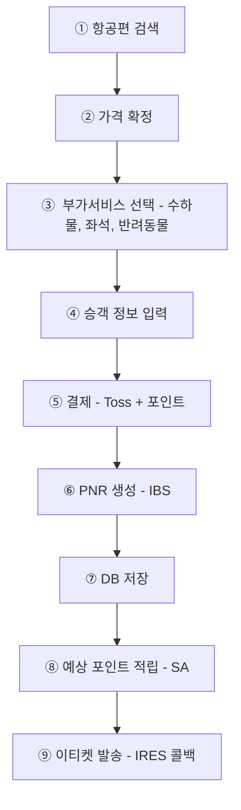
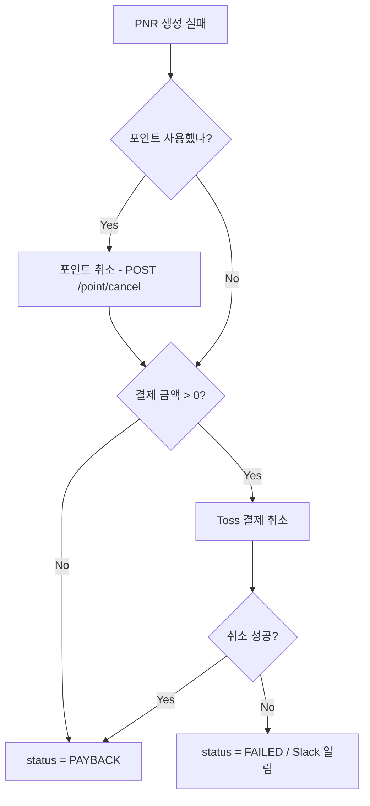
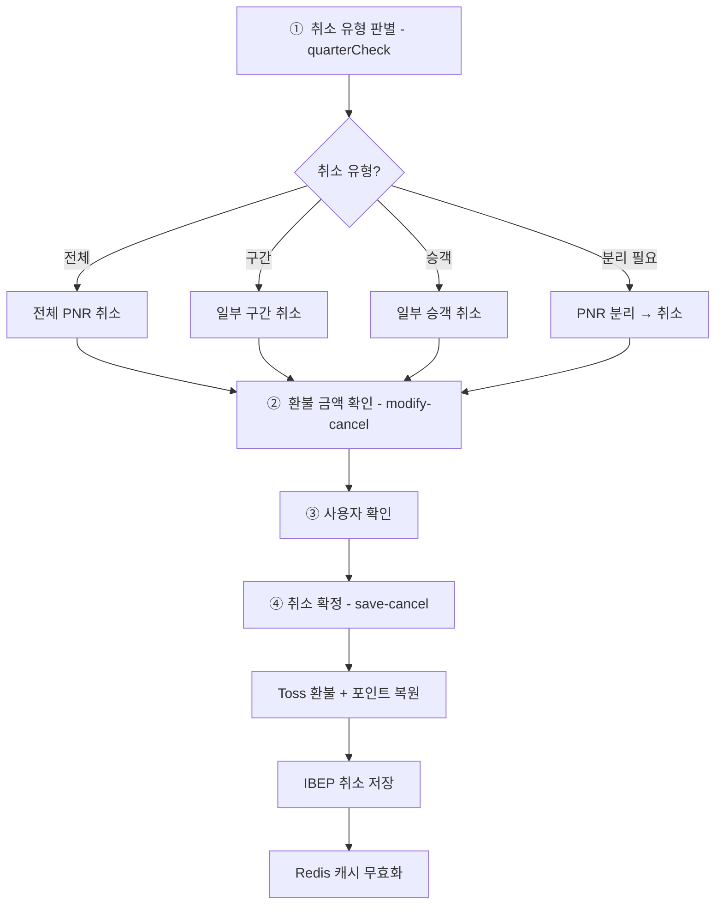
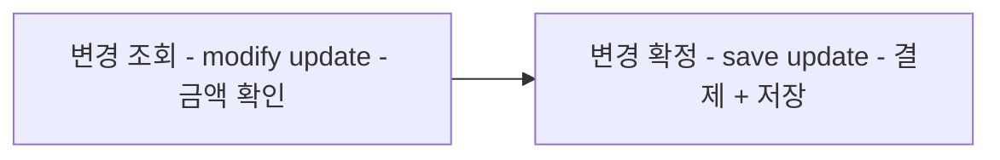
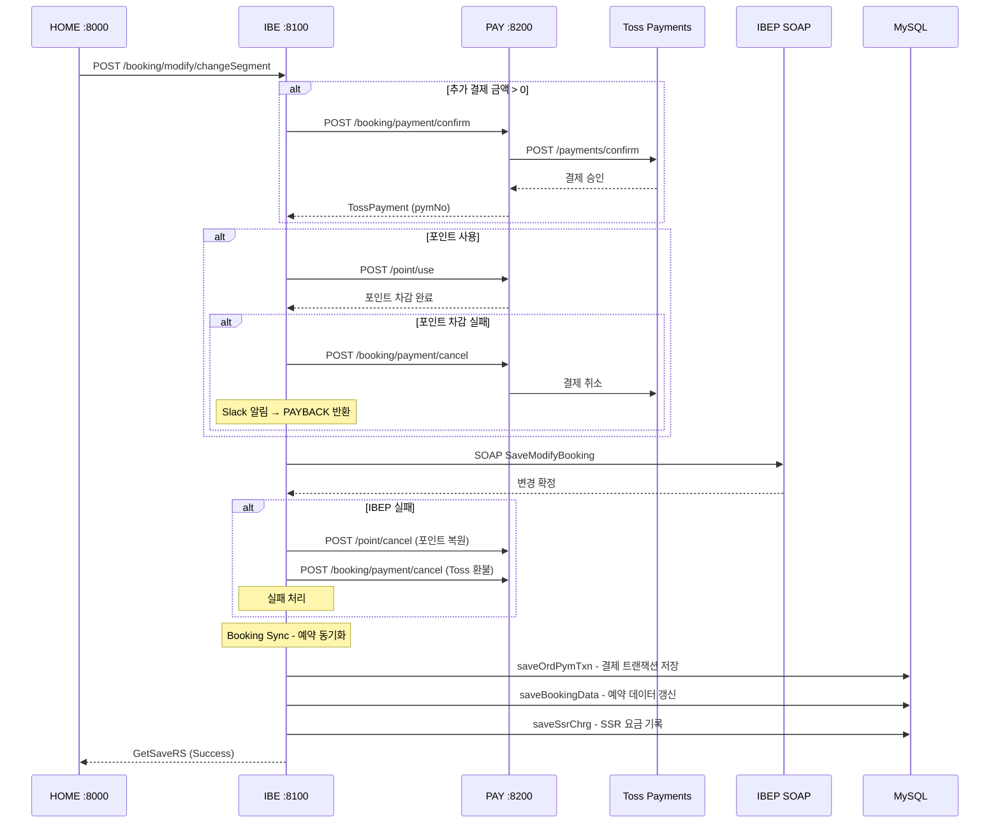
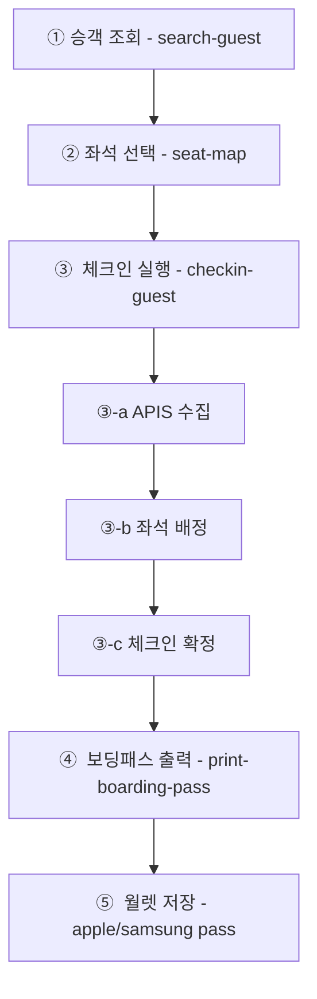
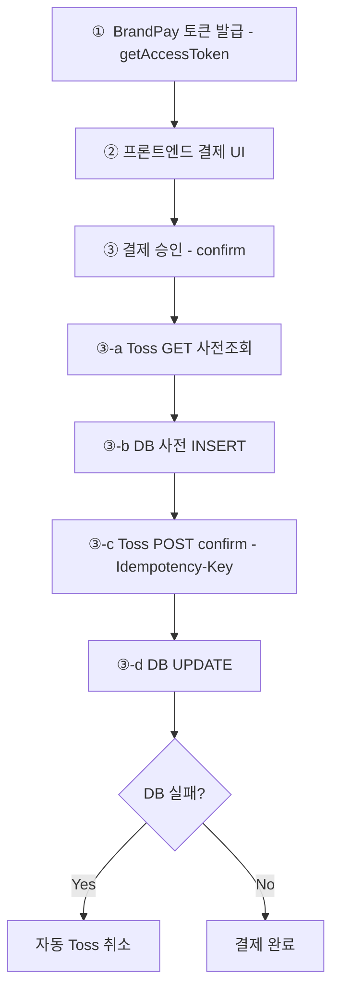
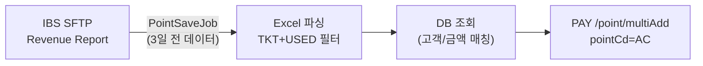
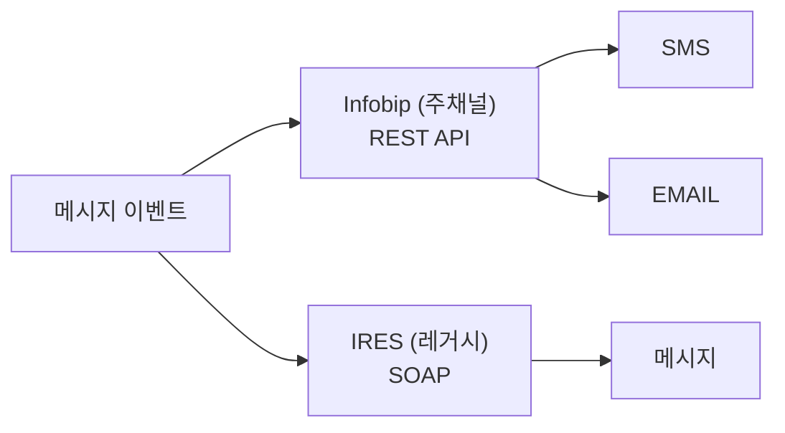

# 주요 업무 흐름

> 사용자 관점의 업무 흐름을 단계별로 설명한다. 시퀀스 다이어그램은 [[03-sequence-diagrams]]를 참조.

---

## 1. 항공권 예약 (전체 흐름)

### 상세 단계

| 단계 | 모듈 | 핵심 동작 |
|------|------|----------|
| 1. 검색 | HOME → IBE → IBES | Redis 캐시 확인 → 미스 시 SOAP 조회 → 180초 캐시 |
| 2. 가격 확정 | HOME → IBE → IBES | 선택 항공편 ConfirmPrice, SSR 요금 포함 |
| 3. 부가서비스 | HOME → IBE → IBES | XBAG(5~25kg), PETC, CBBG, 사전좌석 |
| 4. 승객 입력 | HOME | 회원: DB 프로필 자동, 비회원: 직접 입력 |
| 5. 결제 | IBE → PAY → Toss | Toss 사전조회 → confirm → DB INSERT |
| 6. PNR 생성 | IBE → IBEP | SOAP CreateBooking, 실패 시 결제 롤백 |
| 7. DB 저장 | IBE | OrdPymTxn, BookingData, SsrChrg |
| 8. 포인트 | IBE → PAY | fare × 적립율(5%) = SA 포인트 |
| 9. 이티켓 | IRES → MESSAGE | SendITR 콜백 → Infobip 이메일+SMS |

### 예약 실패 보상 처리

---

## 2. 예약 취소

### 취소 유형 판별 로직 (quarterCheck)

| quarter | 조건 | 처리 |
|---------|------|------|
| 1 | 전체 구간 × 전체 승객 | SegmentChangeType=DELETE, isPnrCancel=true |
| 2 | 일부 구간만 선택 | SegmentChangeType=DELETE (선택 구간만) |
| 3 | 일부 승객, 전체 구간 | PaxChangeType=DELETE (선택 승객) |
| 4 | 일부 승객 × 일부 구간 | SplitReservation → childPNR → 전체 취소 |

---

## 3. 예약 변경 (SSR / 좌석)

### 2단계 프로세스

### SSR 변경 가능 항목

| SSR 코드 | 항목 | ADD | DELETE | 비고 |
|----------|------|-----|--------|------|
| XBAG_5~25 | 추가 수하물 (5~25kg) | O | O | 무게별 코드 |
| PETC | 반려동물 | O | X | |
| CBBG | 기내 수하물 | O (예약 시) | X | 변경 시 availableCount=0 |
| 기타 | 좌석, 서비스 등 | O | X | |

### 결제 흐름 (변경 확정 시)

---

## 4. 웹 체크인

### 전체 프로세스

### 체크인 상태 관리

| DB 테이블 | 상태 | 설명 |
|-----------|------|------|
| ORD_CHKIN_TXN | CHECKED IN | 체크인 완료 |
| ORD_CHKIN_TXN | NO_INFO | 미체크인 / 체크인 취소 |

### 좌석 배치도 상태

| 상태 | 의미 |
|------|------|
| Available | 선택 가능 |
| Block | 선택 불가 |
| Active | 현재 승객 배정 |
| Restricted → Available | 1열(1A~1D) 특수 처리 |

---

## 5. 결제

### Toss Payments 통합 흐름

### 결제 유형

| pymTypeCd | 키 | 설명 |
|-----------|------|------|
| BP | tossBpKey | BrandPay (간편결제) |
| WD | tossWdKey | 일반결제 (카드, 계좌이체 등) |

### Toss 결제 상태 매핑

| Toss 상태 | 내부 코드 | 설명 |
|-----------|----------|------|
| READY | RD | 준비 |
| IN_PROGRESS | IP | 진행 중 |
| DONE | DN | 완료 |
| CANCELED | CC | 전체 취소 |
| PARTIAL_CANCELED | PC | 부분 취소 |
| ABORTED | AR | 중단 |
| EXPIRED | EP | 만료 |

### EasyPay (간편결제) 특이사항
- Toss 응답에서 `card` 객체가 null (일반 카드와 다름)
- NPE 방지 처리 필요 (12-toss-easypay-issue 참조)
- Provider 코드: TP(토스페이), KP(카카오페이), NP(네이버페이), ET(기타)

---

## 6. 포인트

### 포인트 코드 체계

| 코드 | 명칭 | 발생 시점 | 만료 |
|------|------|----------|------|
| PM | 회원가입 | 최초 회원가입 | 3년 |
| SA | 예상적립 | 예약 완료 | - |
| AC | 확정적립 | 배치 처리 (SA→AC) | 3년 |
| US | 사용 | 예약 결제 시 | - |
| CP | 취소환불 | 예약 취소 시 | - |
| SC | 예정취소 | 예약 취소 시 (SA→SC) | - |
| EX | 소멸 | 배치 (3년 경과) | - |

### 포인트 사용 규칙
- **FIFO 방식**: 만료일이 가장 가까운 포인트부터 차감
- **복수 레코드 분산 차감**: 한 건의 사용이 여러 포인트 레코드에 걸칠 수 있음
- **예상 적립 계산**: `fare × 적립율(5%)`, 복합결제 시 포인트 사용분은 fare에서 선차감

### 배치 포인트 확정 흐름

---

## 7. 배치 업무

### 배치 실행 타임라인 (일일)

```mermaid
gantt
    title 일일 배치 스케줄
    dateFormat HH:mm
    axisFormat %H:%M

    section 새벽 배치
    PointExtinctJob (포인트 소멸)    :05:00, 10min
    ScheduleJob (스케줄 갱신)        :05:00, 60min
    RevenueReportJob (매출 보고서)   :06:00, 30min

    section 주기 배치
    WeatherJob (날씨)               :08:00, 15min
    PointSaveJob (포인트 확정)       :09:00, 30min
    BoardingReminderJob (탑승 안내)  :active, 00:00, 1440min
```

### 월간 배치

| Job | 일시 | 설명 |
|-----|------|------|
| HolidayJob | 매월 1일 05:00 | data.go.kr에서 올해+내년 공휴일 갱신 |

### Quartz 클러스터 주의사항
- 다중 노드 환경에서 클러스터 모드 운영
- `ClassNotFoundException` 발생 가능 (특정 Job 클래스가 일부 노드에만 배포된 경우)
- c3p0 커넥션 풀 사용 (Quartz 전용)

---

## 8. 메시징

### 메시지 발송 트리거

| 이벤트 | SMS | Email | 트리거 |
|--------|-----|-------|--------|
| 예약 확인 (이티켓) | O | O | IRES SendITR 콜백 |
| 예약 변경 | O | O | Home → Message |
| 예약 취소 | O | O | Home → Message |
| 체크인 완료 | O | O | Home → Message |
| 운항 변경 | O | O | Batch → Message |
| 회원 가입 환영 | - | O | Home → Message (reg_welcome) |
| 휴면 안내 | - | O | Batch → Message |
| 탑승 안내 | O | O | Batch → Message (출발 3시간 전) |

### 이중 게이트웨이 구조

