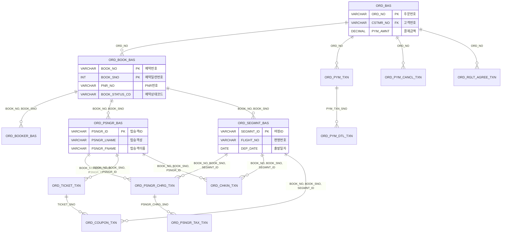
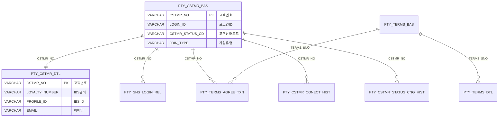
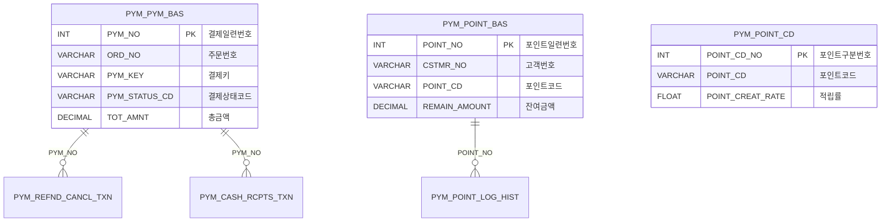
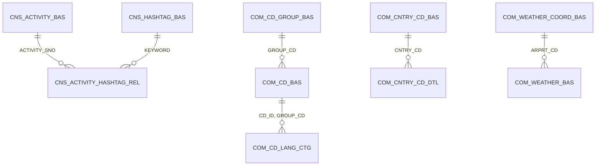

# DB

> 총 65개 테이블. 7개 도메인 프리픽스로 구분.

---

## 테이블 프리픽스 체계

| 프리픽스 | 도메인 | 테이블 수 | 설명 |
|---------|--------|----------|------|
| **ORD_** | 주문/예약 | 18 | 주문, 예약, 승객, 결제, 구간, 체크인, 티켓 |
| **PTY_** | 회원 | 14 | 고객, SNS, 토큰, 약관, 기업, 인증 |
| **PYM_** | 결제/포인트 | 6 | Toss 결제, 포인트, 환불, 현금영수증 |
| **PRD_** | 상품/운영 | 18 | 공항, 노선, 스케줄, 운임, 규정, Revenue |
| **COM_** | 공통 | 8 | 코드, 메뉴, 국가, 날씨, 시퀀스, 메시지 |
| **CNS_** | 콘텐츠 | 6 | 광고, 공지, 소개, 해시태그, 액티비티 |
| **ADM_** | 관리 | 1 | 배치 관리 |

---

## ERD — 전체 관계도

### 주문/예약 도메인

### 회원 도메인

### 결제/포인트 도메인

### 상품/운영 도메인

```mermaid
erDiagram
    PRD_ARPRT_CD_BAS ||--o{ PRD_ARPRT_CD_DTL : "ARPRT_CD"
    PRD_ARPRT_CD_BAS ||--o{ PRD_ARPRT_ATENT_MTTR_BAS : "ARPRT_CD"
    PRD_ARPRT_CD_BAS ||--o{ PRD_ARPRT_TRMINL_BAS : "ARPRT_CD"
    PRD_ARPRT_CD_BAS ||--o{ PRD_ROUTE_BAS : "DEP/ARR"
    PRD_ARPRT_CD_BAS ||--o{ COM_WEATHER_COORD_BAS : "ARPRT_CD"

    PRD_FARE_GROUP_BAS ||--o{ PRD_FARE_GROUP_DTL : "FARE_GROUP_CD"
    PRD_FARE_GROUP_BAS ||--o{ PRD_FARE_CLASS_CD : "FARE_GROUP_CD"
    PRD_FARE_GROUP_BAS ||--o{ PRD_FARE_DSCNT_REL : "FARE_GROUP_CD"
    PRD_FARE_GROUP_BAS ||--o{ PRD_FARE_RGLT_REL : "FARE_GROUP_CD"

    PRD_RGLT_BAS ||--o{ PRD_RGLT_DTL : "RGLT_CD"
    PRD_RGLT_BAS ||--o{ PRD_FARE_RGLT_REL : "RGLT_CD"

    PRD_SCLPST_DSCNT_BAS ||--o{ PRD_SCLPST_DSCNT_DTL : "SCLPST_DSCNT_CD"
    PRD_SCLPST_DSCNT_BAS ||--o{ PRD_FARE_DSCNT_REL : "SCLPST_DSCNT_CD"

    PRD_SCHDUL_BAS ||--o{ PRD_SCHDUL_DTL : "SCHDUL_SNO"
    PRD_SCHDUL_BAS ||--o{ PRD_SCHDUL_BLCK_TXN : "SCHDUL_SNO"
```

### 콘텐츠 도메인

---

## 테이블 상세 명세

### ORD_ (주문/예약)

#### ORD_BAS — 주문기본
| 컬럼 | 타입 | PK | 설명 |
|------|------|:--:|------|
| ORD_NO | VARCHAR(15) | O | 주문번호 |
| ORD_STEP_CD | VARCHAR(20) | | 주문단계코드 |
| ORD_CHNNL_CD | VARCHAR(20) | | 주문채널코드 |
| PYM_AMNT | DECIMAL(15) | | 결제금액 |
| CRNCY_CD | VARCHAR(3) | | 통화코드 |
| ORD_PROC_VALUE | VARCHAR(20) | | 주문처리값 |
| CSTMR_NO | VARCHAR(15) | | 고객번호 |
| CREAT_DT | DATETIME | | 생성일시 |
| UPDT_DT | DATETIME | | 수정일시 |

#### ORD_BOOK_BAS — 예약기본
| 컬럼 | 타입 | PK | 설명 |
|------|------|:--:|------|
| BOOK_NO | VARCHAR(12) | O | 예약번호 |
| BOOK_SNO | INT(9) | O | 예약일련번호 (변경이력 관리용) |
| ORD_NO | VARCHAR(15) | FK | 주문번호 |
| PNR_NO | VARCHAR(6) | | PNR번호 (IBS) |
| NUMBER_PNR_NO | VARCHAR(20) | | 숫자PNR번호 |
| SEGMNT_DIV_CD | VARCHAR(2) | | 여정구분코드 (OW/RT) |
| INTRL_YN | VARCHAR(1) | | 국제선여부 |
| ARLINE_CD | VARCHAR(3) | | 항공사코드 |
| BOOK_STATUS_CD | VARCHAR(20) | | 예약상태코드 |
| BOOK_CNG_CD | VARCHAR(20) | | 예약변경코드 |
| BOOK_CNG_DT | DATETIME | | 예약변경일시 |
| LAST_TXN_YN | VARCHAR(1) | | 최종내역여부 |
| PRNTS_BOOK_NO | VARCHAR(12) | | 부모예약번호 (PNR 분리 시) |
| PRNTS_PNR_NO | VARCHAR(6) | | 부모PNR번호 |
| CHNNL_DIV_CD | VARCHAR(20) | | 채널구분코드 |
| SEAT_CNT | TINYINT(2) | | 좌석수 |
| BOOK_SEPRAT_YN | VARCHAR(1) | | 예약분리여부 |
| SEGMNT_CNG_CNT | TINYINT(2) | | 여정변경수 |

> **BOOK_SNO**: 동일 BOOK_NO에 대해 변경이 발생할 때마다 증가. LAST_TXN_YN=Y인 레코드가 최신.

#### ORD_BOOKER_BAS — 예약자기본
| 컬럼 | 타입 | PK | 설명 |
|------|------|:--:|------|
| BOOK_NO | VARCHAR(12) | O | 예약번호 |
| BOOK_SNO | INT(9) | O | 예약일련번호 |
| MEMBER_BOOK_YN | VARCHAR(1) | | 회원예약여부 |
| BOOKER_LNAME | VARCHAR(30) | | 예약자성 |
| BOOKER_FNAME | VARCHAR(100) | | 예약자이름 |
| CLNCD | VARCHAR(6) | | 국가전화번호 |
| HPNO | VARCHAR(20) | | 휴대폰번호 |
| EMAIL | VARCHAR(100) | | 이메일 |
| CSTMR_NO | VARCHAR(15) | | 고객번호 |

#### ORD_PSNGR_BAS — 탑승객기본
| 컬럼 | 타입 | PK | 설명 |
|------|------|:--:|------|
| BOOK_NO | VARCHAR(12) | O | 예약번호 |
| BOOK_SNO | INT(9) | O | 예약일련번호 |
| PSNGR_ID | VARCHAR(30) | O | 탑승객ID |
| PSNGR_DIV_CD | VARCHAR(20) | | 탑승객구분 (ADULT/CHILD/INFANT) |
| PSNGR_TTL_CD | VARCHAR(20) | | 호칭 (MR/MS/MSTR) |
| PSNGR_LNAME | VARCHAR(30) | | 탑승객성 |
| PSNGR_FNAME | VARCHAR(100) | | 탑승객이름 |
| PSNGR_BRTHDY_DATE | DATE | | 생일 |
| GENDER_CD | VARCHAR(20) | | 성별 |
| CSTMR_NO | VARCHAR(15) | | 고객번호 |
| PRTCTR_PSNGR_ID | VARCHAR(30) | | 보호자탑승객ID (영유아) |

#### ORD_SEGMNT_BAS — 여정기본
| 컬럼 | 타입 | PK | 설명 |
|------|------|:--:|------|
| BOOK_NO | VARCHAR(12) | O | 예약번호 |
| BOOK_SNO | INT(9) | O | 예약일련번호 |
| SEGMNT_ID | VARCHAR(30) | O | 여정ID |
| SEGMNT_STATUS_CD | VARCHAR(30) | | 여정상태코드 |
| CABIN_GRAD_CD | VARCHAR(20) | | 객실등급코드 |
| ARLINE_CD | VARCHAR(3) | | 항공사코드 |
| FARE_CLASS_CD | VARCHAR(20) | | 운임클래스코드 |
| FLIGHT_NO | VARCHAR(10) | | 편명번호 |
| DEP_ARPRT_CD | VARCHAR(3) | | 출발공항코드 |
| DEP_DATE | DATE | | 출발일자 |
| DEP_TM | VARCHAR(6) | | 출발시각 |
| ARR_ARPRT_CD | VARCHAR(3) | | 도착공항코드 |
| ARR_DATE | DATE | | 도착일자 |
| ARR_TM | VARCHAR(6) | | 도착시각 |

#### ORD_PSNGR_CHRG_TXN — 탑승객요금내역
| 컬럼 | 타입 | PK | 설명 |
|------|------|:--:|------|
| PSNGR_CHRG_SNO | BIGINT | O | 탑승객요금일련번호 (AUTO) |
| BOOK_NO, BOOK_SNO, SEGMNT_ID | | FK | 여정 참조 |
| PSNGR_ID | VARCHAR(30) | FK | 탑승객 참조 |
| FARE_GROUP_CD | VARCHAR(20) | | 운임그룹코드 |
| FARE_CLASS_CD | VARCHAR(20) | | 운임클래스코드 |
| FARE_AMNT | DECIMAL(15) | | 운임금액 |
| TAX_TOT_AMNT | DECIMAL(15) | | 세금총금액 |
| TOT_AMNT | DECIMAL(15) | | 총금액 |
| PYM_SNO | INT(11) | | 결제일련번호 |

#### ORD_PSNGR_TAX_TXN — 세금내역
| 컬럼 | 타입 | PK | 설명 |
|------|------|:--:|------|
| PSNGR_CHRG_SNO | BIGINT | O | FK → ORD_PSNGR_CHRG_TXN |
| TAX_CD | VARCHAR(20) | O | 세금코드 |
| IATA_TAX_CD | VARCHAR(20) | | IATA세금코드 |
| TAX_AMNT | DECIMAL(15) | | 세금액 |

#### ORD_CHKIN_TXN — 체크인내역
| 컬럼 | 타입 | PK | 설명 |
|------|------|:--:|------|
| CHKIN_SNO | INT(9) | O | AUTO_INCREMENT |
| BOOK_NO, BOOK_SNO, SEGMNT_ID | | FK | 여정 참조 |
| PSNGR_ID | VARCHAR(30) | FK | 탑승객 참조 |
| SEAT_NO | VARCHAR(4) | | 좌석번호 |
| CHKIN_STATUS_CD | VARCHAR(20) | | 체크인상태 (CHECKED IN / NO_INFO) |
| CHKIN_CHNNL_CD | VARCHAR(20) | | 체크인채널코드 |

#### ORD_SSR_CHRG_BAS — SSR요금기본
| 컬럼 | 타입 | PK | 설명 |
|------|------|:--:|------|
| SSR_CHRG_SNO | INT(11) | O | AUTO_INCREMENT |
| BOOK_NO, BOOK_SNO, SEGMNT_ID, PSNGR_ID | | | 참조 |
| TOT_AMNT | DECIMAL(15) | | 총금액 |

#### ORD_SSR_CHRG_TXN — SSR요금내역
| 컬럼 | 타입 | PK | 설명 |
|------|------|:--:|------|
| SSR_CHRG_TXN_SNO | INT(11) | O | |
| SSR_CHRG_SNO | INT(11) | FK | SSR기본 참조 |
| SSR_CODE | VARCHAR(20) | | SSR코드 (XBAG, PETC 등) |
| SEAT_NO | VARCHAR(4) | | 좌석번호 (사전좌석) |
| SSR_AMNT | DECIMAL(15) | | SSR금액 |

#### ORD_PYM_TXN — 결제내역
| 컬럼 | 타입 | PK | 설명 |
|------|------|:--:|------|
| PYM_TXN_SNO | INT(11) | O | AUTO_INCREMENT |
| ORD_NO | VARCHAR(15) | FK | 주문번호 |
| PNR_NO | VARCHAR(6) | | PNR번호 |
| TOT_AMNT | DECIMAL(15) | | 총금액 |
| PYM_AMNT | DECIMAL(15) | | 결제금액 |
| POINT_AMNT | DECIMAL(15) | | 포인트금액 |

#### ORD_PYM_DTL_TXN — 결제상세내역
| 컬럼 | 타입 | PK | 설명 |
|------|------|:--:|------|
| PYM_SNO | INT(11) | O | AUTO_INCREMENT |
| PYM_TXN_SNO | INT(11) | FK | 결제내역 참조 |
| PYM_DIV_CD | VARCHAR(20) | | 결제구분코드 |
| PYM_KEY | VARCHAR(255) | | Toss 결제키 |
| APRVL_NO | VARCHAR(20) | | 승인번호 |
| TOT_AMNT | DECIMAL(15) | | 총금액 |
| PYM_AMNT | DECIMAL(15) | | 결제금액 |
| POINT_AMNT | DECIMAL(15) | | 포인트금액 |

#### ORD_PYM_CANCL_TXN — 결제취소내역
| 컬럼 | 타입 | PK | 설명 |
|------|------|:--:|------|
| CANCL_SNO | INT(9) | O | AUTO_INCREMENT |
| ORD_NO | VARCHAR(15) | FK | 주문번호 |
| REFND_PYM_AMNT | DECIMAL(15) | | 환불결제금액 |
| REFND_POINT_AMNT | DECIMAL(15) | | 환불포인트금액 |
| REFND_TOT_AMNT | DECIMAL(15) | | 환불총금액 |
| FEE_TOT_AMNT | DECIMAL(15) | | 수수료총금액 |

#### ORD_TICKET_TXN — 티켓내역
| 컬럼 | 타입 | PK | 설명 |
|------|------|:--:|------|
| TICKET_SNO | BIGINT | O | AUTO_INCREMENT |
| BOOK_NO, BOOK_SNO, PSNGR_ID | | FK | 탑승객 참조 |
| TICKET_NO | VARCHAR(15) | | 티켓번호 |
| TICKET_ISSUE_DT | DATETIME | | 발행일시 |

#### ORD_COUPON_TXN — 쿠폰내역
| 컬럼 | 타입 | PK | 설명 |
|------|------|:--:|------|
| TICKET_SNO | BIGINT | O | FK → ORD_TICKET_TXN |
| BOOK_NO, BOOK_SNO, SEGMNT_ID | | O, FK | 여정 참조 |
| COUPON_NO | VARCHAR(20) | | 쿠폰번호 |

#### ORD_BOOK_ERROR_TXN — 예약오류내역
| 컬럼 | 타입 | PK | 설명 |
|------|------|:--:|------|
| BOOK_ERROR_SNO | BIGINT | O | AUTO_INCREMENT |
| BOOK_NO, PNR_NO | | | 예약 참조 |
| BOOK_CNG_CD | VARCHAR(20) | | 예약변경코드 |
| ERROR_CD | VARCHAR(20) | | 오류코드 |
| ERROR_CN | VARCHAR(500) | | 오류내용 |
| CALL_SERVICE_NM | VARCHAR(100) | | 호출서비스명 |
| PROC_YN | VARCHAR(1) | | 처리여부 |

#### ORD_BOOK_PRSNT_TXN — 예약현황내역
| 컬럼 | 타입 | PK | 설명 |
|------|------|:--:|------|
| PNR_NO | VARCHAR(6) | O | PNR번호 |
| PSNGR_ID | VARCHAR(30) | O | 탑승객ID |
| DEP_DATE | DATE | O | 출발일자 |
| FLIGHT_NO | VARCHAR(10) | O | 편명번호 |
| STATUS_CD | VARCHAR(20) | | 상태코드 |

#### ORD_BOOK_TRSF_TXN — 예약이관내역
| 컬럼 | 타입 | PK | 설명 |
|------|------|:--:|------|
| BOOK_NO | VARCHAR(12) | O | 예약번호 |
| BOOK_SNO | INT | O | 예약일련번호 |
| BOOK_TRSF_DIV_CD | VARCHAR(20) | O | 이관구분코드 |

#### ORD_RGLT_AGREE_TXN — 규정동의내역
| 컬럼 | 타입 | PK | 설명 |
|------|------|:--:|------|
| AGREE_SNO | INT(9) | O | AUTO_INCREMENT |
| ORD_NO | VARCHAR(15) | FK | 주문번호 |
| RGLT_CD | VARCHAR(20) | FK | 규정코드 |

#### ORD_CHKIN_TIME — 체크인타임
| 컬럼 | 타입 | PK | 설명 |
|------|------|:--:|------|
| AMD_CODE | VARCHAR(20) | O | 관리코드 |
| AMD_VALUE | VARCHAR(10) | | 속성값 |

---

### PTY_ (회원)

#### PTY_CSTMR_BAS — 고객기본
| 컬럼 | 타입 | PK | 설명 |
|------|------|:--:|------|
| CSTMR_NO | VARCHAR(15) | O | 고객번호 (시퀀스 생성, 성별 접두사) |
| CSTMR_DIV_CD | VARCHAR(20) | | 고객구분코드 |
| CSTMR_STATUS_CD | VARCHAR(20) | | 상태 (ACTIVE/DORMANT/LOCK) |
| LOGIN_ID | VARCHAR(30) | | 로그인ID (이메일) |
| LOGIN_PSWD | VARCHAR(100) | | BCrypt 해시 비밀번호 |
| JOIN_DT | DATETIME | | 가입일시 |
| JOIN_TYPE | NVARCHAR(10) | | 가입유형 (EMAIL/KAKAO/NAVER/GOOGLE) |
| CORP_YN | CHAR(1) | | 기업여부 |
| CORP_SNO | INT(9) | | 기업일련번호 |

#### PTY_CSTMR_DTL — 고객상세
| 컬럼 | 타입 | PK | 설명 |
|------|------|:--:|------|
| CSTMR_NO | VARCHAR(15) | O | FK → PTY_CSTMR_BAS |
| LOYALTY_NUMBER | VARCHAR(10) | | IBS 로열티 넘버 |
| PROFILE_ID | VARCHAR(8) | | IBS 프로필 ID |
| MEMBER_LNAME | VARCHAR(30) | | 성 |
| MEMBER_FNAME | VARCHAR(100) | | 이름 |
| MEMBER_ENG_LNAME | VARCHAR(30) | | 영문성 |
| MEMBER_ENG_FNAME | VARCHAR(100) | | 영문이름 |
| BIRTH_DATE | DATE | | 생년월일 |
| EMAIL | VARCHAR(100) | | 이메일 |
| HPNO | VARCHAR(20) | | 휴대폰번호 |
| HASH_CODE | VARCHAR(255) | | 중복가입 방지 해시 |
| PROMO_CD | VARCHAR(20) | | 프로모션코드 |

#### PTY_SNS_LOGIN_REL — SNS로그인관계
| 컬럼 | 타입 | PK | 설명 |
|------|------|:--:|------|
| SNS_LOGIN_SNO | INT(9) | O | AUTO_INCREMENT |
| SNS_IDNTFR_ID | VARCHAR(255) | | SNS 식별자 |
| CSTMR_NO | VARCHAR(15) | FK | 고객번호 |
| SNS_CD | VARCHAR(20) | | SNS코드 (KAKAO/NAVER/GOOGLE) |
| LINK_YN | VARCHAR(1) | | 연결여부 |

#### PTY_CSTMR_CONECT_HIST — 고객접속이력
| 컬럼 | 타입 | PK | 설명 |
|------|------|:--:|------|
| CSTMR_CONECT_HIST_SNO | BIGINT(18) | O | AUTO_INCREMENT |
| CSTMR_NO | VARCHAR(15) | FK | 고객번호 |
| CONECT_SUCES_YN | VARCHAR(1) | | 성공여부 (5회 실패 시 잠금) |
| CONECT_ERROR_CD | VARCHAR(20) | | 오류코드 |

#### PTY_CORP_BAS — 기업기본
| 컬럼 | 타입 | PK | 설명 |
|------|------|:--:|------|
| CORP_SNO | INT(9) | O | AUTO_INCREMENT |
| CORP_CD | VARCHAR(10) | | 기업코드 |
| CORP_REG_NO | VARCHAR(12) | | 사업자등록번호 |
| PROC_STATUS | VARCHAR(20) | | 처리상태 |
| SCLPST_DSCNT_CD | VARCHAR(20) | | 신분할인코드 |

#### PTY_CRTFC_TXN — 인증코드내역
| 컬럼 | 타입 | PK | 설명 |
|------|------|:--:|------|
| CRTFC_SNO | INT(9) | O | AUTO_INCREMENT |
| CRTFC_DIV_CD | VARCHAR(20) | | 인증타입 (EMAIL/SMS) |
| CRTFC_CD | VARCHAR(6) | | 인증코드 (6자리) |
| VALID_START_DT / VALID_END_DT | DATETIME | | 유효기간 |
| PROC_YN | VARCHAR(1) | | 처리여부 |

---

### PYM_ (결제/포인트)

#### PYM_PYM_BAS — 결제기본
| 컬럼 | 타입 | PK | 설명 |
|------|------|:--:|------|
| PYM_NO | INT(9) | O | 결제일련번호 |
| ORD_NO | VARCHAR(15) | | 주문번호 |
| PYM_KEY | VARCHAR(200) | | Toss paymentKey |
| PYM_STATUS_CD | VARCHAR(2) | | 상태 (RD/IP/DN/CC/PC/AR/EP) |
| PYM_MN_CD | VARCHAR(2) | | 결제수단코드 |
| PYM_TYPE_CD | VARCHAR(2) | | 결제유형 (BP/WD) |
| PYM_SOURCE_CD | VARCHAR(10) | | 결제출처코드 |
| TOT_AMNT | DECIMAL(15) | | 총금액 |
| CRDCMPN_CD | VARCHAR(3) | | 카드사코드 |
| CARD_NO | VARCHAR(128) | | 카드번호 (마스킹) |
| APRVL_NO | VARCHAR(20) | | 승인번호 |
| TOT_CANCL_AMNT | DECIMAL(15) | | 취소총금액 |
| ORDER_ID | VARCHAR(100) | | Toss orderId |

#### PYM_REFND_CANCL_TXN — 환불취소내역
| 컬럼 | 타입 | PK | 설명 |
|------|------|:--:|------|
| CANCL_DELNG_NO | VARCHAR(20) | O | 취소거래번호 |
| PYM_NO | INT(9) | FK | 결제일련번호 |
| REFND_AMNT | DECIMAL(15) | | 환불금액 |
| PYM_STATUS_CD | VARCHAR(2) | | 결제상태코드 |

#### PYM_PYM_LOG_HIST — 결제로그이력
| 컬럼 | 타입 | PK | 설명 |
|------|------|:--:|------|
| USER_CONECT_HIST_SNO | BIGINT(20) | O | |
| ORD_NO | VARCHAR(15) | | 주문번호 |
| PYM_KEY | VARCHAR(200) | | 결제키 |
| PYM_STATUS_CD | VARCHAR(2) | | 결제상태 |
| RM | TEXT | | 에러 상세 |

#### PYM_POINT_BAS — 포인트기본
| 컬럼 | 타입 | PK | 설명 |
|------|------|:--:|------|
| POINT_NO | INT(9) | O | 포인트일련번호 |
| CSTMR_NO | VARCHAR(15) | | 고객번호 |
| POINT_CD | VARCHAR(2) | | 포인트코드 (PM/SA/AC/US/CP/SC/EX) |
| POINT_AMOUNT | DECIMAL(15) | | 포인트금액 |
| REMAIN_AMOUNT | DECIMAL(15) | | 잔여금액 (FIFO 차감) |
| POINT_CREAT_DT | DATETIME | | 생성일시 |
| POINT_EXPIRD_DT | DATETIME | | 만료일시 (생성일+3년) |

#### PYM_POINT_LOG_HIST — 포인트이력
| 컬럼 | 타입 | PK | 설명 |
|------|------|:--:|------|
| POINT_USE_NO | INT(9) | O | 이력일련번호 |
| POINT_NO | INT(9) | O | FK → PYM_POINT_BAS |
| ORD_NO | VARCHAR(15) | | 주문번호 |
| POINT_CD | VARCHAR(2) | | 포인트코드 |
| POINT_AMOUNT | DECIMAL(15) | | 변동금액 |
| REMAIN_AMOUNT | DECIMAL(15) | | 잔여금액 |

#### PYM_POINT_CD — 포인트구분
| 컬럼 | 타입 | PK | 설명 |
|------|------|:--:|------|
| POINT_CD_NO | INT(9) | O | 구분번호 |
| POINT_CD | VARCHAR(2) | | 포인트코드 |
| POINT_CD_NAME | VARCHAR(15) | | 구분명 |
| POINT_PROP_CD | VARCHAR(1) | | 성질구분 (적립/차감) |
| POINT_CREAT_RATE | FLOAT(3) | | 적립률 (5%) |
| POINT_CREAT_AMNT | DECIMAL(15) | | 고정적립금액 |

#### PYM_CASH_RCPTS_TXN — 현금영수증내역
| 컬럼 | 타입 | PK | 설명 |
|------|------|:--:|------|
| CASH_RCPTS_SNO | INT(9) | O | |
| PYM_NO | INT(9) | FK | 결제일련번호 |
| TOT_AMNT | DECIMAL(15) | | 총금액 |
| VAT_AMNT | DECIMAL(15) | | 부가세 |
| SPL_AMNT | DECIMAL(15) | | 공급금액 |

---

### PRD_ (상품/운영)

#### PRD_ARPRT_CD_BAS — 공항코드기본
| 컬럼 | 타입 | PK | 설명 |
|------|------|:--:|------|
| ARPRT_CD | VARCHAR(3) | O | IATA 공항코드 |
| CNTRY_CD | VARCHAR(3) | | 국가코드 |
| AREA_CD | VARCHAR(20) | | 지역코드 |

#### PRD_ARPRT_CD_DTL — 공항코드상세 (다국어)
- PK: ARPRT_CD + LANG_DIV_CD
- ARPRT_NM (공항명), CITY_NM (도시명)

#### PRD_ROUTE_BAS — 노선기본
- PK: DEP_ARPRT_CD + ARR_ARPRT_CD
- INTRL_YN (국제선여부)

#### PRD_SCHDUL_BAS — 스케줄기본
| 컬럼 | 타입 | PK | 설명 |
|------|------|:--:|------|
| SCHDUL_SNO | INT(9) | O | AUTO_INCREMENT |
| DEP_ARPRT_CD | VARCHAR(3) | | 출발공항 |
| ARR_ARPRT_CD | VARCHAR(3) | | 도착공항 |
| SCHDUL_START_DATE | DATE | | 스케줄시작 |
| SCHDUL_END_DATE | DATE | | 스케줄종료 |

#### PRD_SCHDUL_DTL — 스케줄상세
- PK: SCHDUL_SNO + FLIGHT_NO + NVG_START_DATE + NVG_END_DATE + DEP_TM + ARR_TM
- NVG_DAY_VALUE: 7자리 요일 플래그 (1234567)
- ARCRFT_MODEL_CD: 항공기 기종

#### PRD_SCHDUL_CNG_BAS — 스케줄변경기본
- 실제 출발/도착 시각, 결항/지연 사유
- PROC_CD: 처리코드 (결항/지연/변경)

#### PRD_FARE_GROUP_BAS — 운임그룹기본
- PK: FARE_GROUP_CD
- INTRL_YN (국제선여부)

#### PRD_FARE_CLASS_CD — 운임클래스코드
- PK: FARE_CLASS_CD + APPLC_START_DT
- FK → PRD_FARE_GROUP_BAS

#### PRD_SCLPST_DSCNT_BAS — 신분할인기본
- CHRG_DSCNT_CNT/UNIT: 요금할인율
- TAX_DSCNT_CNT/UNIT: 세금할인율
- AGE_LMTT_CD: 나이제한

#### PRD_RGLT_BAS — 규정기본
- PK: RGLT_CD
- RGLT_CATEGORY, NEED_YN (필수여부)

#### PRD_REVENUE_REPORT_TXN — Revenue리포트내역
| 컬럼 | 타입 | PK | 설명 |
|------|------|:--:|------|
| REVENUE_SNO | INT UNSIGNED | O | AUTO_INCREMENT |
| FLIGHT_DATE | DATE | | 운항일 |
| ORIGIN / DESTINATION | VARCHAR(3) | | 출발/도착 |
| FLIGHT_NUMBER | VARCHAR(5) | | 편명 |
| DOCUMENT_NUMBER | VARCHAR(20) | | 문서번호 |
| TRACKING_NUMBER | VARCHAR(6) | | PNR번호 |
| DOCUMENT_TYPE | VARCHAR(10) | | 문서유형 (TKT 등) |
| STATUS | VARCHAR(10) | | 상태 (USED 등) |
| NETVALUE | DECIMAL(15) | | 순수익 |
| POINT_APPLY_STATUS | VARCHAR(10) | | 포인트적용여부 |
| FILE_NM | VARCHAR(200) | | 원본 파일명 |

---

### COM_ (공통)

#### COM_CD_GROUP_BAS / COM_CD_BAS / COM_CD_LANG_CTG — 코드 체계
- 3단 구조: 그룹 → 코드 → 다국어
- PK: GROUP_CD / (CD_ID + GROUP_CD) / (CD_ID + GROUP_CD + LANG_DIV_CD)

#### COM_CNTRY_CD_BAS / COM_CNTRY_CD_DTL — 국가코드
- PK: CNTRY_CD (ISO 3166 alpha-3)
- ALPHA2_CNTRY_CD, CLNCD (국제전화번호)

#### COM_MENU_BAS / COM_MENU_LANG_CTG — 메뉴
- 트리 구조: UPPER_MENU_SNO → MENU_SNO
- ROLE_CDS: 권한코드

#### COM_WEATHER_COORD_BAS / COM_WEATHER_BAS — 날씨
- 좌표: COORD_X, COORD_Y (기상청 격자)
- 날씨 데이터: TMP, POP, PTY, SKY, WSD 등

#### COM_SEQ — 시퀀스
- 테이블별 자동 채번 관리
- CYCL: 주기별 리셋

#### COM_TRNSMIS_TXN / COM_TRNSMIS_RESULT_TXN — 메시지전송
- 전송 요청/결과 이력 관리

---

### CNS_ (콘텐츠)

#### CNS_ADS_BAS — 광고기본
- ADS_TYPE: 광고타입 (슬라이더/팝업/상단공지)
- EXPSR_START_DT ~ EXPSR_END_DT: 노출기간

#### CNS_NOTICE_BAS — 공지사항
- CATEGORY, IMP_YN (주요공지), EXPSR_CNT (조회수)

#### CNS_INTRO_BAS — 소개
- 메인 페이지 소개 콘텐츠

#### CNS_HASHTAG_BAS / CNS_ACTIVITY_BAS / CNS_ACTIVITY_HASHTAG_REL — 해시태그-액티비티
- M:N 관계 (ACTIVITY ↔ HASHTAG)
- REP_YN: 대표 해시태그 여부

---

### ADM_ (관리)

#### ADM_BATCH_BAS — 배치기본
| 컬럼 | 타입 | PK | 설명 |
|------|------|:--:|------|
| JOB_NO | INT(9) | O | AUTO_INCREMENT |
| JOB_CLASS_NAME | VARCHAR(200) | | Job 클래스 FQCN |
| CRON_EXPRESSION | VARCHAR(200) | | Cron 표현식 |

---

## MyBatis Mapper 분포

| 모듈 | Mapper 수 | XML 수 | 비고 |
|------|----------|--------|------|
| common | 101 (Base*) | 198 | 공통 테이블 CRUD |
| home | 33 | 32 | 비즈니스 쿼리 |
| ibe | 7 | 7 | 주문/결제 저장 |
| pay | 3 | 3 | 결제/포인트/쿠폰 |
| batch | 6 | 6 | 배치 데이터 |
| message | 5 | 5 | 메시지/템플릿 |

---

## 네이밍 규칙

| 접미사 | 의미 | 예시 |
|--------|------|------|
| **_BAS** | 기본 (마스터) | ORD_BAS, PTY_CSTMR_BAS |
| **_DTL** | 상세 (다국어/부가정보) | PTY_CSTMR_DTL, PRD_RGLT_DTL |
| **_TXN** | 트랜잭션/내역 | ORD_CHKIN_TXN, PYM_REFND_CANCL_TXN |
| **_HIST** | 이력 | PTY_CSTMR_CONECT_HIST |
| **_REL** | 관계 (M:N) | PTY_SNS_LOGIN_REL, CNS_ACTIVITY_HASHTAG_REL |
| **_CTG** | 분류 (카테고리) | COM_CD_LANG_CTG |
| **_CD** | 코드 마스터 | PYM_POINT_CD, PRD_FARE_CLASS_CD |

## 다국어 패턴
- `LANG_DIV_CD`: ko_KR, en_US 등
- 기본 테이블 + `_DTL` 또는 `_LANG_CTG` 테이블로 다국어 분리
- 적용 테이블: COM_CD, COM_CNTRY_CD, COM_MENU, PRD_ARPRT_CD, PRD_FARE_GROUP, PRD_RGLT, PRD_SCLPST_DSCNT, PTY_TERMS, CNS 전체
