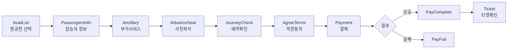

# 페이지 라우팅

## 메인
| 경로 | 설명 |
|------|------|
| `/` | 메인 랜딩 (항공편 검색, 특가, 추천여행, 날씨) |
| `/contents` | 뉴스/블로그/콘텐츠 |
| `/404` | 404 에러 |
| `/500` | 500 에러 |

## 예약 플로우 (`/booking/`)
순서대로 진행되는 예약 단계:

| 경로 | 설명 |
|------|------|
| `/booking/AvailList` | 항공편 가용편 목록/선택 |
| `/booking/PassengersInfo` | 탑승자 정보 입력 |
| `/booking/Ancillary` | 부가서비스 선택 (수하물, 기내식 등) |
| `/booking/AdvanceSeat` | 사전 좌석 배정 |
| `/booking/JourneyCheck` | 예약 내역 확인 |
| `/booking/AgreeTerms` | 약관 동의 |
| `/booking/Payment` | 결제 처리 |
| `/booking/PayComplete` | 결제 성공 |
| `/booking/PayFail` | 결제 실패 |
| `/booking/Ticket` | 예약 확인/티켓 표시 |

## 운항 스케줄 (`/schedule/`)
| 경로 | 설명 |
|------|------|
| `/schedule` | 스케줄 검색 (출발/도착 공항, 날짜) |
| `/schedule/Flight` | 스케줄 결과 |

## 운항 현황 (`/flightStatus/`)
| 경로 | 설명 |
|------|------|
| `/flightStatus` | 운항 현황 검색 |
| `/flightStatus/confirm` | 운항/결항 확인 |
| `/flightStatus/detail` | 상세 운항 정보 |

## 여정 관리 (`/itinerary/`)
| 경로 | 설명 |
|------|------|
| `/itinerary` | 여정 메인 (로그인/예약번호 탭) |
| `/itinerary/myflight` | 내 예약 목록 |
| `/itinerary/myflight/guest` | 비회원 예약 조회 |
| `/itinerary/myflight/info` | 예약 상세 |
| `/itinerary/myflight/info/Guest` | 비회원 예약 상세 |
| `/itinerary/myflight/info/BoardingCheck` | 탑승 정보 확인 |

### 전자 티켓/영수증
| 경로 | 설명 |
|------|------|
| `/itinerary/myflight/info/eTicketReceipt` | 전자 티켓 영수증 |
| `/itinerary/myflight/info/paymentdetail` | 결제 내역 |
| `/itinerary/myflight/info/paymentdetail/PaymentReceipt` | 결제 영수증 |
| `/itinerary/myflight/info/paymentdetail/Receipt` | 일반 영수증 |

### 사전 좌석 배정 (`/itinerary/myflight/info/advanceseat/`)
| 경로 | 설명 |
|------|------|
| `AdvanceCheck` | 사전좌석 자격 확인 |
| `SeatSelection` | 좌석 선택 |
| `Agree` | 약관 동의 |
| `Payment` | 결제 |
| `Complete` | 완료 |
| `PayFail` | 결제 실패 |

### 부가서비스 관리 (`/itinerary/myflight/info/ancillary/`)
| 경로 | 설명 |
|------|------|
| `index` | 부가서비스 목록 |
| `Confirm` | 서비스 확인 |
| `AgreeTerms` | 약관 동의 |
| `Payment` | 결제 |
| `Complete` | 완료 |
| `Cancel` | 취소 시작 |
| `CancelCheck` | 취소 확인 |
| `CancelTerms` | 취소 약관 |
| `CancelComplete` | 취소 완료 |
| `CancelFail` | 취소 실패 |

### 여정 취소 (`/itinerary/myflight/info/journey/`)
| 경로 | 설명 |
|------|------|
| `Cancel` | 예약 취소 시작 |
| `CancelCheck` | 취소 자격 확인 |
| `CancelTerms` | 취소 약관 동의 |
| `CancelComplete` | 취소 완료 |

### 웹 체크인 (`/itinerary/webcheckin/`)
| 경로 | 설명 |
|------|------|
| `Ticket` | 체크인 티켓 정보 |
| `Personnel` | 탑승자 정보 |
| `PersonnelEdit` | 탑승자 정보 수정 |
| `SeatSelection` | 좌석 선택 |
| `Agree` | 체크인 약관 동의 |
| `BoardingPass` | 보딩패스 생성 |
| `Complete` | 체크인 완료 |

### 체크인 관리 (`/itinerary/myflight/info/checkin/`)
| 경로 | 설명 |
|------|------|
| `Cancel` | 체크인 취소 |
| `Complete` | 체크인 완료 확인 |

## 회원/인증 (`/customer/`)
| 경로 | 설명 |
|------|------|
| `/customer/main` | 로그인/회원가입 메인 |

### 비회원 (`/customer/guest/`)
| 경로 | 설명 |
|------|------|
| `startEmail` | 이메일 입력 |
| `agreeTerms` | 약관 동의 |
| `authNumbers` | 인증번호 확인 |
| `complete` | 비회원 예약 완료 |

### 회원가입 (`/customer/member/join/`)
| 경로 | 설명 |
|------|------|
| `infoForm` | 회원 정보 입력 |
| `agreeTerms` | 약관 동의 |
| `authNumbers` | 이메일/폰 인증 |
| `complete` | 가입 완료 |

### 비밀번호 재설정 (`/customer/member/reset/`)
| 경로 | 설명 |
|------|------|
| `emailConfirm` | 이메일 확인 |
| `infoConfirm` | 본인 확인 |
| `authNumbers` | 인증코드 입력 |
| `password` | 새 비밀번호 |
| `complete` | 재설정 완료 |

### 기타 회원
| 경로 | 설명 |
|------|------|
| `/customer/member/startEmail` | 계정 복구 |
| `/customer/member/accountExist` | 중복 계정 안내 |
| `/customer/member/dormancy` | 휴면 계정 해제 |

## 법인 (`/corporation/`)
| 경로 | 설명 |
|------|------|
| `Join` | 법인 회원 등록 |
| `AgreeTerms` | 약관 동의 |
| `Complete` | 등록 완료 |

## 마이페이지 (`/mypage/`)
| 경로 | 설명 |
|------|------|
| `/mypage` | 대시보드 |
| `AuthNumbers` | 계정 인증 |
| `Complete` | 작업 완료 |
| `EasyLogin` | SNS 간편 로그인 |
| `EmailChange` | 이메일 변경 |
| `PhoneChange` | 전화번호 변경 |
| `Point` | 포인트 관리 |
| `GiftCard` | 상품권/쿠폰 |

### 설정 (`/mypage/setting/`)
| 경로 | 설명 |
|------|------|
| `index` | 설정 메인 |
| `PwChange` | 비밀번호 변경 |
| `Marketing` | 마케팅 동의 |
| `Complete` | 설정 저장 완료 |

### 회원탈퇴 (`/mypage/setting/withDrawal/`)
| 경로 | 설명 |
|------|------|
| `Reason` | 탈퇴 사유 선택 |
| `Confirm` | 탈퇴 확인 |
| `Complete` | 탈퇴 완료 |

### 법인 (`/mypage/corporation/`)
| 경로 | 설명 |
|------|------|
| `Application` | 법인 등록 신청 |
| `Complete` | 신청 완료 |
